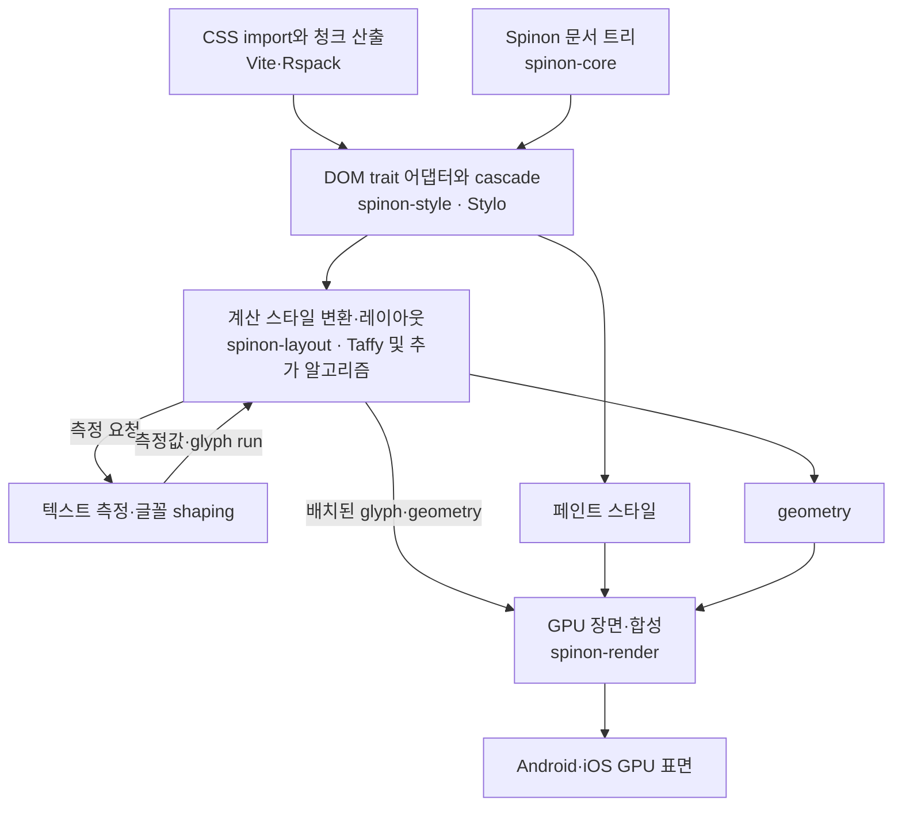

# CSS·Stylo·레이아웃 구현 계획

**문서 상태:** 구현 계획 초안 · **구현 우선순위:** Android·iOS 모바일 우선 · **최종 목표:** 고정 Chromium 기준 CSS 동작 100% 호환 · **현재 제품 지원 완료:** 없음

이 문서는 [CSS 호환 명세](../../spec/0008-css-compatibility.md)의 범위를 어떤 순서로 구현할지 정리한다. Android·iOS 모바일 화면과 CSS 경로를 먼저 완성하고, 웹 빌드는 동일한 작성 코드와 고정 Chromium 기준 동작을 확인하는 대상으로 유지한다. 진행 상태의 SSOT는 [구현 상태 대장](../../spec/STATUS.md)의 `C01`~`C30`이다. 이 계획의 단계나 실험 통과만으로 제품 지원 완료를 선언하지 않는다. 첫 공식 릴리스 범위도 여기서 정하지 않는다.

## 현재 근거와 공백

- 현재 checkout에는 `spikes/stylo-style`과 `spikes/blitz-stylo-layout` 경로가 없다. `spikes/style-layout`은 Lightning CSS AST와 Taffy `0.14.0`을 시험하며 Stylo DOM/cascade 연결은 하지 않는다.
- 제품 workspace는 Stylo [`0.22.0`](https://crates.io/crates/stylo/0.22.0), `stylo_dom 0.22.0`, `selectors 0.41.0`을 고정했다. C03에서 Selector DOM adapter를 구현하고 모바일 Rust target 컴파일을 확인했다. stylesheet cascade·computed style·Taffy 변환·GPU 표시 근거는 아직 없다.
- C04 첫 코드 조각은 `spinon-style::StylesheetRegistry`의 UTF-8 입력, Stylo origin, 등록 순서와 parser 진단 보존이다. 외부 `@import`를 처리할 로더는 제공하지 않는다. 이 목록은 Stylist cascade·computed style과 다르며, C01의 Chromium 비교 fixture를 확장한 뒤 계산 단계로 이어간다.
- R10은 Taffy의 트리 갱신·좌표·합성 텍스트 측정을 비교했다. 실제 글꼴 shaping·줄바꿈·GPU 화면을 검증하지 않았다.
- C02 production 추출과 fixture 전용 adapter prototype은 [Vite `8.3.1`·Rspack `2.2.7` 기록](../../spec/internal/evidence/css-c02-bundler-2026-10-01.md)에 있다. 양쪽 production build에서 CSS Module named import, 조건 suffix가 있는 로컬·외부 `@import`, SVG·WOFF2 자원, entry/dynamic/shared chunk를 확인했다. Vite 기본 CSS Module 객체 import는 통과하고 Rspack은 `namedExports: false` 설정으로 맞출 수 있다. Rspack stats는 CSS source/module graph와 원본 위치를 주고 Vite manifest는 chunk·CSS·asset 연결을 준다. 번들러별 collector가 [내부 계약 후보](../../spec/internal/0011-css-resource-adapter-c02.md)의 공통 snapshot으로 정규화한다. Vite 기본 경고에는 원본 CSS 위치가 없지만 fixture adapter가 입력 CSS parser 위치를 보존해 Rspack의 `2:24` raw column과 정규화된 1-based `2:25`를 맞췄다. 이 prototype은 상대 경로 fixture만 처리하며 package resolver, 최종 graph 직렬화, 제품 패키지/API, 모바일/OTA 연결을 구현하지 않았으므로 C02는 미완료다.
- R03은 `HostDocument`·불변 snapshot의 내부 코어 모델을 `spinon-core`에 추가했고, C03은 snapshot을 Stylo `0.22.0` DOM·selector trait에 연결했다. 공개 DOM façade와 스타일 변환 계층, 계산 스타일→Taffy 경계는 별도 작업이다.

### C01 초기 기준 산출물

초기 Chromium oracle은 Chrome `154.0.8037.92` / Chromium revision `@334b65d254ccc35df4fca82706d1753227b01039`, macOS `26.5.1` (`25F80`, arm64)로 고정했다. viewport `800×600` CSS px, device scale factor `1`, locale `en-US`, time zone `UTC`, light/no-preference/forced-colors none을 CDP에서 명시한다. 실행 파일·fixture·CSS 자원의 SHA-256 및 전체 관찰값은 [C01 비교 기록](../../spec/internal/evidence/css-c01-chromium-ua-2026-10-01.md)과 연결된 JSON 스냅샷에 보존한다.

Node.js 내장 WebSocket과 Chromium DevTools Protocol로 9개 HTML 요소를 확인한다. 초기 Chromium UA 계산값과 다른 값으로 시작하는 author baseline을 먼저 적용한 뒤 `supported-elements-v0.css`를 추가해, 19개 computed CSS 선언이 baseline을 덮고 기준값과 일치하는지 비교한다. baseline·프로필·기준 계산값을 모두 저장하고, capture tool·브라우저·입력 해시와 실행 조건을 고정한다. 19개 값은 모두 일치했고 9개 요소 ID는 별도 fixture 범위 검사로 통과했다. 예전 `ua-v0`의 selector 집합 9개는 규칙 적용 여부를 증명하지 못해 현재 비교 자료에서 철회했다. 새 비교도 UA cascade origin, Rust FFI, Stylo, 레이아웃, 글꼴, GPU 픽셀 또는 Android·iOS 동작을 검증하지 않는다. SVG와 전체 CSS inventory도 아직 고정하지 않았으므로 C01은 미완료다.

## 소유 모듈과 데이터 흐름

| 모듈 | 소유할 구현 |
| --- | --- |
| `crates/spinon-core` | R03 `HostDocument` 내부 트리·안정 핸들·속성·요소 상태·문서/표시 revision snapshot. 기존 S01 `Tree`와 레이아웃 모듈은 아직 분리됨 |
| `crates/spinon-style` | Stylo [`0.22.0`](https://crates.io/crates/stylo/0.22.0) HostDocument DOM trait adapter와 stylesheet 파싱·출처·등록 순서. 후속 작업에서 selector/cascade/inheritance, computed style 캐시와 무효화, 미지원 진단을 연결 |
| `crates/spinon-layout` | Stylo computed value→레이아웃 style 변환, Taffy 노드 ID 대응, 텍스트·이미지 measure callback, dirty subtree 갱신, 좌표 정책 |
| `crates/spinon-render` | 페인트 속성 변환, GPU 장면, stacking·clip·composite·hit-test |
| Vite·Rspack 패키지 | CSS import·CSS Modules·에셋 참조·원본 위치·JS 청크별 CSS 의존성을 웹·모바일 산출물에 연결 |

Blitz DOM은 런타임 의존성에 넣지 않는다. `stylo_taffy`의 변환 코드는 대응 관계를 확인하는 참고 자료로 사용한다. 자체 변환기는 실제 지원 계약에 필요한 항목부터 만들고, MPL 고지와 원본 보존 등 라이선스 의무를 확인한 뒤 코드 재사용 범위를 정한다.

Taffy는 현재 제공하는 Block·Flexbox·Grid 알고리즘에 적용한다. 전체 CSS 목표를 달성하기 위해 `spinon-layout` 경계는 Taffy에 고정하지 않는다. 필요한 알고리즘을 자체 구현하거나 다른 검증된 알고리즘으로 확장할 수 있도록 CSS 값 변환과 레이아웃 알고리즘 dispatch를 분리한다.

## 우선순위와 완료 관문

| 단계 | 먼저 구현할 것 | 통과 기준 |
| --- | --- | --- |
| P0 · 기준·연결 | Chromium 비교 기준과 버전, 지원 HTML/SVG 노드·UA stylesheet 프로필, CSS 기능 inventory와 fixture별 출력·허용 오차, CSS 번들 경로, Spinon DOM용 Stylo adapter, selector/cascade·상속·변수, 값·단위 변환, box model, 미지원 위치 진단 | Stylo `0.22.0` 계산 스타일을 Spinon 노드별로 얻고, 지원·미지원 선언을 원본 위치와 함께 구분한다. 선택자·계산값·레이아웃·페인트 결과를 고정 fixture와 비교하며 CSS 의미 차이를 래스터 허용 오차와 분리한다. |
| P1 · 모바일 앱 레이아웃 | Block·inline·Flex·Grid의 우선 속성, position·containing block, overflow·scroll, 내재 크기, 실제 글꼴 측정·줄바꿈, 기본 페인트 | 공통 화면 fixture의 computed value·geometry·텍스트 박스가 Chromium, Android, iOS에서 비교되고 허용 차이와 원인이 기록된다. |
| P2 · 반응형·동적 | pseudo-class·pseudo-element, media/support/container query, cascade layers, CSS 변수 변경, transform·clip·stacking, image sizing, transitions·animations | 상태 변경과 화면 크기 변경 뒤 선택자·cascade·layout·paint가 일관된 revision에서 갱신되고 취소·제거된 스타일 자원이 재사용되지 않는다. |
| P3 · 고급 CSS | 표·float·다단, 쓰기 모드·logical properties, advanced Grid, SVG·폼 외형, filters·masks·blend·containment 및 at-rule 확장 | 각 기능군의 표준·Chromium fixture와 미지원 진단이 정리되고 Android·iOS 차이가 적합성 자료에 남는다. |
| P4 · 100% 갭 종료 | 고정한 Chromium 기능 inventory 전체, 속성·값 조합·선택자·상태·동적 갱신 회귀, 성능·메모리·OTA 청크 경계 | 기준 inventory의 CSS 동작 차이가 모두 닫히고, 웹·Android·iOS 전체 적합성 묶음과 근거가 저장된다. 차이가 남아 있으면 100% 완료가 아니다. |

우선순위는 모바일 우선의 작업 순서이며 최종 범위 제외 목록이 아니다. 웹 호환성은 포기하지 않으며, 웹 빌드는 기준 동작과 작성 코드 호환을 확인하는 경로로 둔다. 모든 C 작업은 구현 전에 비교 모델을 준비한다. 비교 모델에는 기준 oracle, 재현 fixture와 실행 환경, 관찰 출력, 허용 오차·실패 규칙이 들어간다. CSS 외 다른 기능도 같은 원칙을 따르며 공통 규칙은 [구현 전 비교 모델](../../spec/0001-conformance.md#구현-전-비교-모델)에 둔다. 기준 Chromium 버전이 바뀌면 기능 inventory를 버전별로 다시 만들고 신규·변경·삭제된 동작을 분류한다.

## 의존성과 병렬 작업 경계

1. R03의 내부 `HostDocumentSnapshot`이 C03 adapter의 입력이다. 기존 S01 `Tree`를 직접 연결하지 않는다. 현재 HostDocument는 혼합 노드·속성·namespace·상태·revision을 갖고 Stylo DOM·selector trait adapter와 연결됐지만, V8 DOM façade와 계산 스타일은 없다.
2. C03 DOM traversal·namespace adapter와 selector matcher fixture는 완료했다. C04의 CSS oracle·cascade·inline declaration 및 첫 화면 판정은 C01 comparator와 C02 bundle CSS resource 계약을 통과한 입력에 연결한다. S10 계산값과 `spinon-layout` 연결은 별도 구현·판정으로 남는다.
3. `C02`의 CSS 자원 추출 실험과 `C01`의 Chromium fixture 형식은 서로 독립적이다. 기능 진입점→CSS·폰트·이미지 의존 그래프의 최종 직렬화는 R15·X01·D02의 매니페스트 계약을 따른다.
4. `C05` 스타일 무효화, `C06` 값·단위, `C07` box model이 정해진 뒤 `C08`~`C14` layout adapter를 진행한다. layout 입력 자료형과 invalidation boundary가 고정된 뒤 Flex·Grid·positioning 알고리즘을 분리해 진행한다.
5. `C15`~`C19` 텍스트·페인트 작업은 같은 computed-style snapshot과 revision 계약을 사용한다. 텍스트 측정과 GPU painter는 레이아웃 속성 변환과 독립적으로 개발할 수 있지만, 공통 fixture를 합칠 때만 완료를 판정한다.
6. 반응형·상태 선택자·애니메이션은 frame scheduling과 CSS invalidation 순서에 의존하므로 `C20`~`C25` 구현 전에 상태 변경·스타일 갱신·GPU 제출의 revision 순서를 고정한다.

병렬 작업 중 공용 DOM trait, computed-style snapshot, Taffy node ID와 CSS 자원 revision을 여러 작업이 동시에 바꾸지 않는다. 각 인터페이스는 선행 작업 하나가 소유하고, 병렬 작업은 버전이 있는 내부 계약에 맞춘다.

## CSS 처리 경계

1. Vite·Rspack은 CSS 입력과 모듈·에셋·원본 위치·JS 청크별 CSS 의존성을 추적한다. CSS 노드는 번들 내 `@import`와 stylesheet 기준 URL로 해석된 로컬 `url()` 폰트·이미지에 타입 있는 그래프 edge를 갖는다. `data:` 자원은 포함된 CSS 콘텐츠 해시에 속하고, JS 런타임이 생성하는 inline style·CSS 규칙은 그 JS 청크에 포함한다. 외부 네트워크 CSS `@import`·`url()` 로더는 미구현이며 현재 모바일은 요청하지 않고 미지원으로 진단한다. 웹 산출물은 브라우저의 CSS 엔진을 사용한다. 모바일은 해당 릴리스 snapshot의 번들 CSS 자원을 Stylo에 전달하며, 문서 트리와 CSS 자원은 `spinon-style`에서 합쳐진다. 릴리스 산출물은 [빌드·OTA 계약](../../spec/0004-runtime-build.md)과 세부 그래프 정책 [OTA 설계](../ota-design.md)를 따른다.
2. Stylo는 스타일 문법 해석과 선택자·cascade·상속·computed style의 기준이다. C03은 `spinon-style`에서 R03 snapshot을 DOM·selector trait으로 제공한다. 내장 UA 규칙은 컴파일 자원으로 보존하며 C04에서 UA cascade 출처에 등록한다. DOM adapter나 자원이 존재한다는 사실만으로 계산 스타일·레이아웃·GPU 화면 적용을 완료 처리하지 않는다.
3. `spinon-layout`은 computed style에서 Taffy 또는 확장 알고리즘이 이해하는 값을 만든다. layout algorithm이 처리하지 못하는 속성을 CSS 엔진에서 계산됐다는 이유로 지원 처리하지 않는다.
4. layout은 텍스트·이미지 자원에 측정을 요청하고 결과를 받아 geometry와 줄 배치를 계산한다. 배치된 glyph와 geometry는 GPU 장면으로 전달한다. 합성 측정 결과와 실제 플랫폼 글꼴 결과를 분리해 검증한다.
5. `spinon-render`는 layout이 아닌 페인트 속성과 합성 규칙도 GPU 장면으로 변환한다. box-shadow 등 페인트 결과를 Taffy style에 넣지 않는다.
6. Lightning CSS는 CSS import·CSS Modules·최적화 및 의미 변환 후보로만 평가한다. 모바일의 CSS 파싱·selector·cascade·computed style 소유자는 Stylo다. 의미를 바꾸는 prefix 변환·속성 제거·색상 축약은 Stylo와 Chromium 비교를 통과하기 전까지 모바일 산출 경로에 포함하지 않는다.

Tailwind는 별도 모바일 렌더러가 아니다. 빌드 시 생성된 CSS가 C02의 공통 CSS 산출 경로로 들어오며, 유틸리티가 사용하는 선택자·선언·값·변수·계층을 모바일에서 각각 지원할 때만 해당 유틸리티를 같은 동작으로 판정한다. Tailwind 생성 CSS의 선택자·변수·`@layer`·Preflight는 R14 실험에서 작은 fixture로 확인하고 U01에서 빌드 경로로 확장한다. Preflight·테마·반응형 및 상태 변형은 별도 적합성 사례로 남긴다. 세부 대응 범위는 [웹 표면 명세의 Tailwind 계약](../../spec/0003-web-surface.md)을 따른다.

CSS stylesheet 교체는 JS 모듈과 동일한 릴리스 snapshot·청크 의존성에 포함한다. HMR은 개발 계획, OTA는 [청크 OTA 설계](../ota-design.md)에 따르며 오래된 스타일시트가 새 트리 revision에 섞이지 않도록 자원 세대를 검증한다.

## 구현 전에 고정할 세부 기준

- 웹 oracle로 실행할 Chromium의 정확한 revision/build·OS 이미지·플래그와 업데이트 주기, 다른 웹 엔진을 지원 대상으로 추가할 때의 별도 행렬, CSSWG/WPT fixture 버전
- fixture별 viewport·device scale·locale·글꼴 집합·미디어 및 사용자 선호 상태
- 지원 HTML·SVG 노드와 Chromium UA 기본 stylesheet의 범위; 내장 구조 규칙 초안은 [`spinon-style`](../../crates/spinon-style/resources/ua/supported-elements-v0.css)에 있지만 C01 기준 버전과 비교 전에는 Chromium 일치로 간주하지 않는다. 폼 컨트롤의 OS별 외형은 별도 프로필로 남긴다.
- 속성·값·선택자·at-rule 단위의 안정된 feature ID, 지원 노드 프로필, 자동 fixture 입력·기대값·fixture별 허용 오차 형식
- `@import` 번들 자원의 기준 URL, `media`·`supports`·`layer` 순서, 순환·실패; 외부 URL 로더는 미구현이며 재검토 시 URL·출처·캐시·취소·오류·R12/J06 보안 경계를 별도 계약으로 결정
- CSS 파싱/계산/레이아웃/페인트/동적 적용 단계별 오류와 원본 source map 위치
- CSS px, device scale, safe area, viewport·font·container 기준과 반올림 시점
- 실제 글꼴 로딩·fallback·shaping·emoji·RTL과 플랫폼별 폰트 차이 기록 방식
- Taffy가 다루지 못하는 기능을 추가 알고리즘으로 연결할 조건과 유지보수 비용 판정
- 기능 진입점에서 JS 청크·CSS stylesheet·폰트·이미지로 이어지는 공유 의존 그래프와 자원 revision을 앱 코드와 원자적으로 활성화하는 계약

## 검증 계획

새 CSS feature는 기능명만으로 완료하지 않는다. 각 fixture는 입력 HTML·CSS, 기준 Chromium 버전, 기대 selector match·computed style·geometry·GPU 캡처·이벤트 상태, 플랫폼, 명시적 허용 오차, 실패 진단을 보관한다.

비교 결과는 세 층으로 판정한다.

1. **CSS 의미:** selector match 집합, cascade 승자와 정규화한 computed value를 비교한다. 원소·선언 누락이나 잘못된 값은 시각 점수로 상쇄하지 않는다.
2. **레이아웃:** 각 노드의 `x/y/width/height`, 줄 상자·baseline과 scroll extent를 CSS px로 측정한다. fixture별 `max(|Δx|, |Δy|, |Δwidth|, |Δheight|)`를 주 판정값으로 두고, 평균 오차는 원인 분석용으로만 기록해 하나의 크게 틀린 노드를 가리지 않게 한다. 좌표 비교는 [CSSOM View의 CSS px 정의](https://drafts.csswg.org/cssom-view-1/#css-pixels)를 따른다.
3. **GPU 이미지:** 같은 CSS viewport와 명시한 raster scale로 캡처해 픽셀 채널 차이의 최대값과 허용 범위를 벗어난 픽셀 수/비율을 함께 기록한다. antialias·글꼴 래스터 차이는 별도 분류하고, 허용 범위는 [WPT reftest의 fuzzy 비교](https://web-platform-tests.org/writing-tests/reftests.html)처럼 fixture별로 한정한다. 화면을 임의로 확대·축소해 맞추지 않는다.

한계값은 동일 입력을 반복 실행해 계측 노이즈를 확인한 뒤, 플랫폼·기능 fixture별로 실행 전에 고정한다. 테스트 실패 뒤 한계만 넓혀 통과시키지 않는다. Chromium 비교와 Android/iOS 간 GPU 회귀 캡처는 분리해 기록한다. 합성 텍스트 테스트는 실제 글꼴 테스트를 대체하지 않는다.

한 속성의 단일 값 통과는 전체 속성 지원을 뜻하지 않는다. 상속·percentage reference·writing direction·상태 변화·부모 크기 변경·스타일 제거·동일 프레임 갱신을 함께 고려한다. CSS 지원 체크를 완료로 바꿀 때는 [구현 상태 대장](../../spec/STATUS.md)의 해당 ID, 공개 CSS 계약·예제, 웹·Android·iOS 적합성 자료를 같은 변경에 반영한다.
