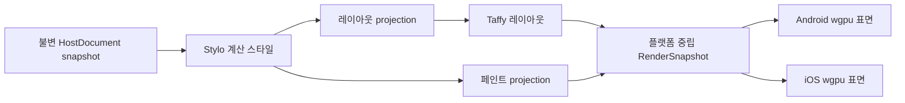

# 0019 · S04 첫 CSS·레이아웃·GPU 연결 슬라이스

**계약 버전:** `0.1.0-draft` · **상태:** 사용자 검토 전 초안 · **구현:** 미구현 · **공개 API:** 아님

## 목적과 완료 범위

기존 C04.2 고정 Chromium Flex 픽스처를 기하 기준으로 사용해 아래 경계를 Android와 iOS에서 끝까지 연결하는 안을 제안합니다. 실제 CSS 페인트를 포함하는 안에서는 fixture에 고정 배경색을 추가하고 Chromium computed-style 기대값을 확장해야 합니다.



이것은 **픽스처 전용 내부 실험**입니다. 사용자 UI 런타임, 일반 CSS 지원, 공개 DOM, 프레임워크 어댑터, 지속적인 프레임 처리, 실제 입력 이벤트 경로를 구현하거나 완료 처리하지 않습니다. 완료해도 S04 전체 완료나 C04/C08/C19 CSS 지원 완료를 뜻하지 않습니다.

기하 기준은 [C04.2 픽스처](../../tests/fixtures/css/c04/style-layout-bridge.v1.json), [CSS 원본](../../tests/fixtures/css/c04/style-layout-bridge.css), [고정 Chromium 비교 기록](evidence/css-c04-style-layout-bridge-2026-10-03.md)입니다. 기준은 301×40 CSS px, 부모 1개와 자식 3개이며 각 좌표·크기의 Chromium 대비 최대 절대 오차는 0.5 CSS px입니다. 페인트를 추가해도 기존 v1 fixture/reference는 덮어쓰지 않고 새 S04 fixture와 Chromium reference를 만듭니다.

## 계층별 연결 계약

| 경계 | 입력 | 출력·불변 조건 | 오류·미지원 정책 |
| --- | --- | --- | --- |
| 문서 → cascade | 한 번 커밋된 `HostDocumentSnapshot`과 같은 세대·revision의 `StyloDocumentView` | `DocumentGeneration`, `DocumentRevision`, `RenderTreeRevision`을 유지 | 세 값 중 하나라도 다르면 계산 전체를 거부합니다. 부분 트리나 최신값으로의 자동 대체는 없습니다. |
| cascade → layout | C04.2 `FlexLayoutV1` 계산 스타일과 고정 author CSS | 기존 `spinon-style-to-layout` projection으로 제한 Taffy 입력을 만듭니다. | Stylo 진단, 미지원 선언·값, 텍스트 노드가 있으면 전체 요청을 거부합니다. CSS 값을 Taffy 기본값으로 조용히 떨어뜨리지 않습니다. |
| cascade → paint | 같은 Stylo computed-style 결과에서 `background-color`만 별도 추출 | `background-color`는 Taffy에 전달하지 않습니다. `spinon-style-to-layout`과 분리된 paint projection 결과를 render join에 전달하는 안입니다. | 값 누락·미지원 색 구문·계산 진단은 전체 요청을 실패시킵니다. 현재 adapter의 위치·crate 책임은 결정 전입니다. |
| layout·paint → RenderSnapshot | 같은 문서 revision의 전체 `LayoutOutput`과 선택된 paint profile | 부모와 자식 3개를 `NodeId`, root-relative `LayoutFrame`, paint 값으로 모두 보존합니다. 좌표는 CSS px 실수값입니다. | 노드 누락·중복·비유한 좌표·revision 불일치는 부분 snapshot 대신 오류입니다. |
| RenderSnapshot → 플랫폼 호스트 | 불변 snapshot과 대상 surface generation | 플랫폼별 Rust 호스트가 동일한 노드·좌표·색 순서로 사각형 장면을 제출합니다. surface acquire, queue submit, `present()` 호출을 각각 기록하고 화면 캡처는 별도 증거로 둡니다. | 플랫폼 객체나 `wgpu` handle은 Rust 공용 snapshot에 넣지 않습니다. 표면 세대가 바뀐 제출은 폐기합니다. `present()` 호출은 실제 화면 표시를 증명하지 않습니다. |
| 플랫폼 호스트 → JS 입력 | 이번 슬라이스에서는 연결하지 않음 | 터치 hit-test나 JS 이벤트 callback을 성공 기준에 넣지 않습니다. | R08 데모의 표면 탭은 DOM 노드 이벤트가 아닙니다. S03 이벤트 계약이 정해지기 전에는 노드 callback으로 보고하지 않습니다. |

### 픽스처 RenderSnapshot 제안

아래는 내부 자료형을 검토하기 위한 구조 예시이며 공개 Rust API나 안정 ABI가 아닙니다.

```rust
struct StaticRenderSnapshot {
    source: StaticRenderSource,
    viewport_css_px: CssSize,
    boxes: Vec<StaticRenderBox>,
}

struct CssSize {
    width: f32,
    height: f32,
}

struct StaticRenderSource {
    document_generation: DocumentGeneration,
    document_revision: DocumentRevision,
    render_tree_revision: RenderTreeRevision,
    layout_profile: LayoutProfileId,
    paint_profile: PaintProfileId,
    fixture_id: String,
    fixture_sha256: [u8; 32],
    stylesheet_sha256: [u8; 32],
    chromium_reference_id: String,
}

struct StaticRenderBox {
    node_id: NodeId,
    frame_css_px: LayoutFrame,
    paint: StaticPaint,
    paint_order: u32,
}

enum StaticPaint {
    OpaqueCssSrgb { red: u8, green: u8, blue: u8 },
    DiagnosticSrgb { red: u8, green: u8, blue: u8 },
}

enum LayoutProfileId {
    FlexLayoutV1,
}

enum PaintProfileId {
    OpaqueBackgroundColorV1,
    DiagnosticColorV1,
}
```

- `boxes`는 fixture 트리의 root-first preorder이며 모든 레이아웃 노드가 정확히 한 번 나와야 합니다. 이 순서는 겹침·stacking context에 대한 CSS 일반 규칙이 아닙니다.
- `fixture_sha256`, `stylesheet_sha256`, `chromium_reference_id`는 출처를 서로 혼동하지 않도록 각각 식별합니다. 현재 computed-style snapshot에는 독립 `StyleRevision`이 없으므로 이 fixture 출처로 제품의 동적 stylesheet revision을 대신하지 않습니다.
- 프레임 ID와 surface generation은 플랫폼 제출 시점에 호스트가 붙입니다. 표시 성공은 Rust snapshot 생성이나 GPU queue 제출만으로 판정하지 않고 플랫폼 present 결과와 별도로 기록합니다.

## 렌더링 정책 제안

다음은 첫 슬라이스를 위한 권고안입니다. **제품 정책으로 승인된 값이 아닙니다.**

1. **페인트(권고):** 각 fixture 요소에 불투명 `background-color`를 지정하고 Stylo computed value를 RenderSnapshot까지 전달합니다. 첫 색상 profile은 author 입력 `#RRGGBB`와 alpha 1만 허용하며 computed value 문자열은 Chromium oracle과 정확히 비교합니다. `color`, `opacity`, gradient, border, blend는 제외합니다. offscreen sRGB target의 중심 픽셀 RGB bytes를 입력 기대값과 정확히 비교하고, Android/iOS 화면 캡처는 surface에 실제 장면이 보이는지 확인합니다. 기존 픽스처에는 배경색이 없으므로 이 선택을 하면 fixture와 Chromium oracle을 확장해야 합니다. 이 좁은 사례는 C08/C19 전체 완료를 뜻하지 않습니다.
2. **진단색 대안:** CSS paint를 다음 단계로 미루고 고정 node ID에 연결한 불투명 진단색을 사용합니다. 이 선택은 layout geometry→GPU 전달만 증명하고 CSS computed paint가 화면에 도달함을 증명하지 않습니다.
3. **좌표:** Taffy의 CSS px `f32` 좌표를 CPU에서 정수로 반올림하지 않습니다. 픽셀 변환은 GPU 제출 경계에서 한 번만 합니다. 실험에서는 1 CSS px을 Android dp·iOS point 1단위에 대응시키고, surface backing scale을 한 번 적용하는 안을 권고합니다. 이 좌표 정책은 기존 S02/R10 계약으로 확정되지 않았습니다.
4. **뷰포트·안전 영역:** 이 fixture의 계산 viewport는 301×40 CSS px이고 root 원점은 surface content의 왼쪽 위입니다. safe area와 화면 전체 root 배치는 포함하지 않습니다. 테스트용 GPU 영역의 배치·크기는 fixture 바깥 호스트가 정합니다.
5. **장면 갱신:** 전체 장면을 한 번 생성·제출합니다. 부분 갱신, dirty region, 프레임 병합, 동적 변경 queue 정책은 이 실험에서 정하지 않습니다.
6. **플랫폼 backend:** 기존 R08의 `wgpu` 표면 연결을 재사용하고 실제 선택 backend·장치·surface format을 근거에 남깁니다. Android 자동 fallback 정책이나 기기 지원표를 확정하지 않습니다.
7. **스레드:** 새 렌더 전용 스레드나 JS 대기 정책을 이번 계약에서 정하지 않습니다. Rust snapshot 변환은 플랫폼 객체가 없는 결정적 단계로 두고, 플랫폼 제출의 thread/queue 소유권은 별도 계약 전에 고정하지 않습니다.
8. **오류:** cascade·layout·snapshot 변환은 전체 성공 또는 전체 실패입니다. GPU 표면 설정·획득·제출 오류를 각각 기록합니다. 첫 프레임 실패는 표시 완료로 보고하지 않습니다.

불투명 sRGB 배경색을 선택하면 CSS의 encoded sRGB 값을 기준으로 GPU 색을 전달하고, sRGB surface는 linear shader 출력으로, non-sRGB UNORM surface는 명시적 sRGB encoding으로 맞추는 안을 권고합니다. 이 규칙은 R08의 색상 차이를 전체 제품에서 해결한 것이 아니라 해당 fixture의 출력 색을 고정하기 위한 좁은 정책입니다.

`wgpu::SurfaceTexture::present()`는 표시 요청이며 화면에 실제 보인 시각이나 성공 callback을 제공하지 않습니다. 이 슬라이스에서는 `present()` 호출을 기록하고, 실제 화면 증거는 Android·iOS 시뮬레이터 캡처로 확인합니다. `commit-to-present` 시각이나 실제 표시 완료 지연은 이 작업의 성능 지표가 아닙니다.

`spinon-style-to-layout`은 지금처럼 레이아웃 속성만 검증해 Taffy로 보냅니다. 색상을 추가할 경우 선택지는 paint projection을 별도 crate(`spinon-style-to-render`)에 두거나 Stylo 의존 타입을 숨기는 neutral paint snapshot을 `spinon-style`에서 제공하는 것입니다. 첫 안을 권고하지만 crate 경계는 미결정이며, `spinon-render`가 Stylo 내부 타입을 직접 소비하게 두지는 않습니다.

## 비교 모델과 통과 기준

| 확인 층 | 비교 기준 | 통과 조건 |
| --- | --- | --- |
| computed style | 기존 C04.2 layout 기준과 새 S04 paint fixture의 고정 Chromium reference | computed property 문자열이 정확히 일치하고 진단이 없습니다. 기존 C04.2 reference 결과는 바꾸지 않습니다. |
| layout | Chromium `154.0.8037.95`의 C04.2 프레임 | 모든 node의 x/y/width/height 각각 최대 오차 0.5 CSS px 이하입니다. node 평균으로 실패를 상쇄하지 않습니다. |
| RenderSnapshot | 같은 입력을 사용한 Rust 직접 기준 자료 | ID, preorder, source revision, viewport, CSS px 좌표가 결정적으로 같습니다. 실패 입력에서 부분 snapshot이 나오지 않습니다. |
| GPU 출력 | Android·iOS별 simulator 화면 캡처와 로그, 고정 `Rgba8UnormSrgb` offscreen target readback | 네 상자가 화면에서 snapshot의 순서·상대 위치·크기와 맞는지 확인합니다. CSS 색상 경로는 offscreen target 각 상자 중심의 RGB bytes가 기대값과 정확히 같아야 합니다. 전체 화면 픽셀은 OS 간 완전 일치를 요구하지 않습니다. |

Chromium computed style·geometry는 CSS/layout oracle입니다. GPU screenshot은 해당 snapshot이 각 표면에 도달했음을 보이는 별도 증거이며, 좁은 불투명 배경색 확인 외에 글꼴·전체 화면 CSS 적합성 oracle로 사용하지 않습니다. Android emulator와 iOS simulator 결과는 실기기 근거나 성능 근거로 확대 해석하지 않습니다.

## 이번 슬라이스에서 하지 않는 것

- `color`, `opacity`, border, transform, clip, z-index, stacking context의 화면 표현
- C08 Block formatting, C19 paint subset, 전체 Flexbox·Grid·CSSOM·동적 stylesheet 무효화
- 텍스트 shaping·폰트 측정·이미지 decode/upload·scroll
- UI 입력 hit-test, DOM 이벤트 순서·취소·캡처·버블링, JS callback
- 접근성 의미 트리, VoiceOver/TalkBack, IME
- 앱 런타임의 연속 frame scheduling·backpressure·thread ownership, 부분 렌더 갱신
- HMR·OTA·CSS 자원 교체와 style/resource generation 활성화

## 남은 결정

| 결정 | 권고 | 결정이 필요한 이유 |
| --- | --- | --- |
| 첫 시각 출력의 색 | **권고:** 불투명 `background-color`만 Stylo computed value로 전달합니다. 진단색을 고르면 layout→GPU geometry만 증명한다고 표기합니다. | 두 선택은 CSS가 실제 화면까지 연결되는지와 fixture·색상 변환 작업 범위를 바꿉니다. |
| CSS px와 OS 논리 단위 | 1 CSS px = 1 Android dp = 1 iOS point, 실제 backing scale은 GPU 경계에서 1회 적용을 권고합니다. | 기존 S02는 px↔dp/point 변환을 명시적으로 미정으로 남겼습니다. |
| 동적 style revision | fixture에서는 입력 해시를 사용하고, 제품 연결 전 별도 `StyleRevision`과 환경 revision을 계약화합니다. | 현재 cascade·layout snapshot은 stylesheet 변경 및 viewport 변경의 독립 revision을 갖지 않습니다. |
| paint projection 소유 모듈 | `spinon-style-to-render`를 별도 adapter로 두고, render crate에는 중립 색상 타입만 전달하는 안을 권고합니다. | Stylo computed-style과 GPU render 내부 타입이 각자 다른 crate 경계를 넘어 직접 노출되지 않도록 해야 합니다. |
| 전체 S04의 입력 경로 | 이번 GPU 화면 뒤에 별도 단계로 둡니다. S03의 이벤트 callback·대상 수명 계약과 표시된 frame 기준이 먼저 필요합니다. | R08의 표면 탭은 노드 이벤트를 검증하지 않습니다. |
| backend 실패·fallback | 이번 fixture에서는 관찰한 backend를 기록하고 실패를 드러냅니다. 제품 선택·fallback 정책은 R08/R13에서 결정합니다. | R08은 emulator/simulator 부분 결과이며 자동 대체·실기기 지원은 미검증입니다. |

색상 범위와 CSS px 좌표는 구현 착수 전에 사용자와 합의해야 합니다. paint adapter 소유 위치도 코드 구조를 고정하기 전에 결정해야 합니다. 나머지는 fixture 전용 범위로 한정하는 권고이며, 제품 경로에 들어가기 전에 별도 내부 계약으로 승격합니다.

## 확정 후 실행할 체크리스트 초안

아래 체크박스는 후보 작업이며, 위의 색상 및 좌표 결정을 검토하기 전에는 구현 착수·완료 표시하지 않습니다.

- [ ] **S04.1 계약 확정** — CSS paint 포함 여부, 좌표 정책, paint projection 소유 위치와 versioned fixture/snapshot shape를 확정하고 이 문서의 초안을 버전 올려 고정합니다.
- [ ] **S04.2 CSS fixture·oracle 추가** — 배경색 경로를 선택하면 기존 C04.2 v1을 수정하지 않고 S04 v1 fixture/CSS를 새로 만들며 `#RRGGBB` computed-style 기대값과 Chromium reference hash를 고정합니다. 진단색 경로에서는 색상 CSS를 추가하지 않고 geometry-only 범위를 명시합니다.
- [ ] **S04.3 Rust snapshot 변환** — 선택된 paint profile과 고정 입력에서 결정적인 `StaticRenderSnapshot`을 만들고 잘못된 revision·누락/중복 노드·비유한 frame의 전체 실패를 확인합니다.
- [ ] **S04.4 Android GPU 연결** — 동일 snapshot을 R08 `wgpu` Android surface에 제출하고 선택 backend·surface generation·실패/present 로그와 화면 캡처를 남깁니다.
- [ ] **S04.5 iOS GPU 연결** — 동일 snapshot을 R08 `wgpu` iOS surface에 제출하고 surface generation·실패/present 로그와 화면 캡처를 남깁니다.
- [ ] **S04.6 교차 플랫폼 대조** — 두 플랫폼 캡처를 Chromium geometry oracle 및 RenderSnapshot과 대조하고 시뮬레이터 한계를 실행 근거에 기록합니다.
- [ ] **S04.7 후속 계약 분리** — 전체 CSS paint(C08/C19), 동적 style/environment revision, JS hit-test/event, 연속 frame/queue/thread 정책을 각 소유 명세와 상태 ID에 연결합니다. 이번 픽스처 실험을 제품 S04 완료로 바꾸지 않습니다.

## 관련 계약과 근거

- [S02 레이아웃 엔진 `0.3.0-draft`](0009-layout-engine.md)
- [C04.1 stylesheet cascade](0016-c04-basic-cascade.md)
- [C04.2 computed style→Taffy adapter `0.1.0`](0017-c04-style-layout-bridge.md)
- [S03.1 V8 HostDocument 변경 묶음 `0.1.0`](0018-s03-v8-hostdocument-bridge.md)
- [R08 wgpu 표면 실험](evidence/r08-wgpu-surface-2026-09-29.md)
- [C04.2 실행 근거](evidence/css-c04-style-layout-bridge-2026-10-03.md)
