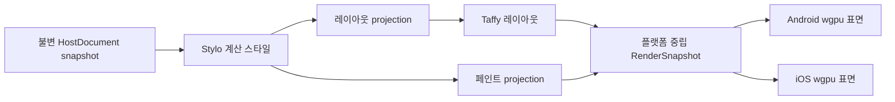

# 0019 · S04 첫 CSS·레이아웃·GPU 연결 슬라이스

**계약 버전:** `0.2.0-draft` · **상태:** S04.1 정책 확정 · **구현:** 미구현 · **공개 API:** 아님

## 목적과 완료 범위

기존 C04.2 고정 Chromium Flex 픽스처를 기하 기준으로 유지하고, 새 고정 CSS 배경색 픽스처를 Android와 iOS GPU 화면까지 연결합니다. C04.2 v1 fixture와 reference는 변경하지 않습니다.



이것은 **픽스처 전용 내부 실험**입니다. 사용자 UI 런타임, 일반 CSS 지원, 공개 DOM, 프레임워크 어댑터, 지속적인 프레임 처리, 실제 입력 이벤트 경로를 구현하거나 완료 처리하지 않습니다. 완료해도 S04 전체 완료나 C04/C08/C19 CSS 지원 완료를 뜻하지 않습니다.

기하 기준은 [C04.2 픽스처](../../tests/fixtures/css/c04/style-layout-bridge.v1.json), [CSS 원본](../../tests/fixtures/css/c04/style-layout-bridge.css), [고정 Chromium 비교 기록](evidence/css-c04-style-layout-bridge-2026-10-03.md)입니다. 기준은 301×40 CSS px, 부모 1개와 자식 3개이며 각 좌표·크기의 Chromium 대비 최대 절대 오차는 0.5 CSS px입니다. 페인트를 추가해도 기존 v1 fixture/reference는 덮어쓰지 않고 새 S04 fixture와 Chromium reference를 만듭니다.

### 기존 C04.2 profile과 CSS 배경색 경로

현재 C04.2 `FlexLayoutV1` 입력 검증은 레이아웃 속성만 허용합니다. `background-color`를 추가한 stylesheet를 그대로 전달하면 기존 검증기가 거부하며, 기존 adapter도 `FlexLayoutV1` 이외의 profile을 거부합니다. 따라서 CSS 배경색 경로는 C04.2 v1을 재사용한다고 표현할 수 없습니다.

- **확정 경로:** 새 S04 fixture·reference와 새 `S04FlexPaintV1` profile을 사용합니다. 이 profile은 C04.2 레이아웃 속성 전체와 명시적 `background-color`만 허용하고 한 번의 Stylo cascade에서 두 결과를 만듭니다. 기존 `FlexLayoutV1` 계약과 fixture/reference는 변경하지 않습니다. 진단색 대안은 선택하지 않았습니다.
- CSS 경로에서는 새 profile의 레이아웃 속성을 명시적으로 `LayoutStyle`로 투영하는 S04 경로를 추가합니다. 기존 `spinon-style-to-layout` 함수에 새 profile을 묵시적으로 넣지 않습니다. paint projection은 플랫폼 중립 불투명 sRGB 색으로 변환합니다. 두 projection은 `DocumentGeneration`·`DocumentRevision`·`RenderTreeRevision` 세 값과 전체 노드 ID 집합이 정확히 같아야 결합할 수 있습니다.
- 새 computed-style profile은 Chromium 비교용 computed serialization과 별도로, `NodeId`에 대응하는 typed `OpaqueCssSrgb` 값을 paint projection에 제공합니다. 현재 `ComputedStyleSnapshot`의 문자열 map만으로 이 타입이 생기는 것은 아니므로 S04 경로에서 Stylo computed color를 읽는 typed 출력 계약을 추가해야 합니다. paint adapter는 CSS 문자열을 다시 파싱하거나 Stylo 내부 타입을 renderer에 노출하지 않습니다.
- author stylesheet allowlist도 새 profile에 한해 레이아웃 허용 목록과 `background-color`의 합집합으로 제한합니다. 이 fixture의 author color 값은 여섯 자리 `#RRGGBB`만 허용하고 다른 color 문법·그 외 선언·inline style·parse 진단은 실패입니다. CSS 값은 새 Chromium reference와 computed serialization을 정확히 비교하고, paint 변환은 CSS 직렬화 문자열 재파싱 대신 Stylo computed color에서 중립 색 값을 만듭니다.

## 계층별 연결 계약

| 경계 | 입력 | 출력·불변 조건 | 오류·미지원 정책 |
| --- | --- | --- | --- |
| 문서 → cascade | 한 번 커밋된 `HostDocumentSnapshot`과 같은 세대·revision의 `StyloDocumentView` | `DocumentGeneration`, `DocumentRevision`, `RenderTreeRevision`을 유지 | 세 값 중 하나라도 다르면 계산 전체를 거부합니다. 부분 트리나 최신값으로의 자동 대체는 없습니다. |
| cascade → layout | 진단색 경로는 C04.2 `FlexLayoutV1`; CSS 배경색 경로는 새 `S04FlexPaintV1` | 선택한 computed-style profile을 명시적으로 검증하고 레이아웃 필드만 같은 `TaffyFlexSubsetV1` projection으로 보냅니다. 기존 C04.2 입력·adapter 동작은 유지합니다. | Stylo 진단, profile 밖 선언·값, 텍스트 노드가 있으면 전체 요청을 거부합니다. 새 computed-style profile을 기존 adapter에 묵시적으로 전달하지 않습니다. |
| cascade → paint | 새 `S04FlexPaintV1`의 typed computed color | `background-color`를 Stylo computed color에서 불투명 sRGB 중립 값으로 변환합니다. Taffy에는 전달하지 않습니다. 변환은 `spinon-style-to-render`가 소유하고 Stylo 내부 타입은 경계 밖으로 내보내지 않습니다. | 누락 색·불투명하지 않은 값·`#RRGGBB` 이외의 author 문법·계산 진단은 전체 요청을 실패시킵니다. |
| layout·paint → RenderSnapshot | 같은 입력의 전체 `LayoutOutput`과 선택된 paint projection | 부모와 자식 3개를 `NodeId`, root-relative `LayoutFrame`, paint 값으로 모두 보존합니다. `DocumentGeneration`, `DocumentRevision`, `RenderTreeRevision` 세 값이 layout·paint projection에서 모두 같아야 합니다. 좌표는 CSS px 실수값입니다. | 노드 누락·중복·비유한 좌표·세 revision 중 하나라도 불일치하면 부분 snapshot 대신 오류입니다. |
| RenderSnapshot → 플랫폼 호스트 | 불변 snapshot과 host submission envelope의 frame ID·대상 surface generation | 플랫폼별 Rust 호스트가 같은 노드·좌표·색 순서로 사각형 장면을 제출합니다. `get_current_texture` 상태, `Queue::submit`의 `SubmissionIndex`, `Queue::present` 요청과 화면 캡처를 별도 기록합니다. fixture의 surface 수명 변경·generation 확인·획득·제출·표시 요청은 R13 UI-thread host sequence에서 직렬화합니다. | 플랫폼 객체나 `wgpu` handle은 Rust 공용 snapshot에 넣지 않습니다. 대기 중 대상 surface generation이 바뀌면 획득 전에 해당 제출을 폐기합니다. surface generation은 대상 extent와 backing scale 변경도 반영하며, CSS viewport와 물리 surface 전체 크기를 직접 비교하지 않습니다. 획득한 `SurfaceTexture`가 남아 있는 동안에는 재구성하지 않습니다. 같은 device queue에는 이 sequence만 제출합니다. present 요청·GPU 작업 완료 callback은 화면 표시 완료를 증명하지 않습니다. 이 실험의 선택은 앱 전체 렌더 스레드 정책을 정하지 않습니다. |
| 플랫폼 호스트 → JS 입력 | 이번 슬라이스에서는 연결하지 않음 | 터치 hit-test나 JS 이벤트 callback을 성공 기준에 넣지 않습니다. | R08 데모의 표면 탭은 DOM 노드 이벤트가 아닙니다. S03 이벤트 계약이 정해지기 전에는 노드 callback으로 보고하지 않습니다. |

### 픽스처 RenderSnapshot 제안

아래는 내부 자료형을 검토하기 위한 구조 예시이며 공개 Rust API나 안정 ABI가 아닙니다.

```rust
struct StaticRenderSnapshot {
    source: StaticRenderSource,
    viewport_css_px: CssSize,
    boxes: Vec<StaticRenderBox>,
}

struct SnapshotId(u64);

struct FrameId(u64);

struct SurfaceGeneration(u64);

struct SurfaceSubmissionEnvelope {
    snapshot_id: SnapshotId,
    frame_id: FrameId,
    surface_generation: SurfaceGeneration,
}

struct CssSize {
    width: f32,
    height: f32,
}

struct StaticRenderSource {
    document_generation: DocumentGeneration,
    document_revision: DocumentRevision,
    render_tree_revision: RenderTreeRevision,
    computed_style_profile: ComputedStyleProfileId,
    layout_projection: LayoutProjectionId,
    paint_profile: PaintProfileId,
    fixture_id: String,
    fixture_sha256: [u8; 32],
    stylesheet_sha256: [u8; 32],
    chromium_reference_id: String,
    chromium_reference_sha256: [u8; 32],
}

struct StaticRenderBox {
    node_id: NodeId,
    frame_css_px: LayoutFrame,
    paint: StaticPaint,
    paint_order: u32,
}

struct OpaqueCssSrgb {
    red: u8,
    green: u8,
    blue: u8,
}

enum StaticPaint {
    OpaqueCssSrgb(OpaqueCssSrgb),
    DiagnosticSrgb { red: u8, green: u8, blue: u8 },
}

enum ComputedStyleProfileId {
    FlexLayoutV1,
    S04FlexPaintV1,
}

enum LayoutProjectionId {
    TaffyFlexSubsetV1,
}

enum PaintProfileId {
    OpaqueBackgroundColorV1,
    DiagnosticColorV1,
}
```

- `boxes`는 fixture 트리의 root-first preorder이며 모든 레이아웃 노드가 정확히 한 번 나와야 합니다. 이 순서는 겹침·stacking context에 대한 CSS 일반 규칙이 아닙니다.
- fixture의 문자열 ID(`flex-parent`, `flex-a` 등)와 내부 `NodeId` 사이의 대응은 S04 fixture에 명시하고 일대일이어야 합니다. preorder만으로 ID 대응을 추정하지 않습니다. `computed_style_profile`은 Stylo 입력 계약, `layout_projection`은 Taffy에 전달할 필드 집합을 각각 식별합니다.
- `OpaqueCssSrgb`의 세 채널은 CSS `#RRGGBB` 순서의 encoded sRGB 8-bit 값이며 alpha는 항상 255입니다. 이 타입은 CSS 직렬화 문자열이나 Stylo 타입을 뜻하지 않습니다.
- `fixture_sha256`, `stylesheet_sha256`, `chromium_reference_id`, `chromium_reference_sha256`는 출처와 비교 자료의 바이트를 고정합니다. 현재 geometry reference SHA-256은 `366cd9c12b514bd78dbe7f7d2b2ab0b9fe376d2b16b873a18c0c695d3fac8d36`입니다. CSS 페인트를 택하면 새 S04 paint reference ID와 SHA-256을 기록합니다. 현재 computed-style snapshot에는 독립 `StyleRevision`이 없으므로 이 fixture 출처로 제품의 동적 stylesheet revision을 대신하지 않습니다.
- snapshot ID, frame ID와 surface generation은 플랫폼 host submission envelope에서 연계합니다. surface generation은 표면 교체·재구성, 대상 크기 또는 backing scale 변동 때 증가합니다. 오래된 envelope는 acquire 전에 버려 같은 snapshot의 로그·캡처를 연결할 수 있어야 합니다. snapshot 생성, queue submission index, GPU 완료 callback, `Queue::present` 요청은 화면 표시 성공 또는 표시 시각을 뜻하지 않습니다.

## S04.1 확정 정책

다음은 첫 fixture 슬라이스에 적용할 정책입니다. 제품 전체의 CSS·렌더링 지원 범위나 앱 전역 스레드 정책을 정하지 않습니다.

1. **페인트:** 새 S04 fixture의 부모와 자식 세 요소에 서로 다른 고정 불투명 `background-color: #RRGGBB`를 지정하고, 새 `S04FlexPaintV1`로 computed color를 RenderSnapshot까지 전달합니다. `color`, `opacity`, gradient, border, blend, alpha는 제외합니다. computed serialization은 새 Chromium oracle과 정확히 비교하고, 오프스크린 출력은 아래의 고정 지점에서 RGBA bytes를 정확히 비교합니다. 기존 fixture에는 배경색이 없으므로 새 fixture와 Chromium reference를 추가합니다. 이 좁은 사례는 C08/C19 전체 완료를 뜻하지 않습니다.
2. **진단색 대안:** CSS paint를 다음 단계로 미루고 고정 node ID에 연결한 불투명 진단색을 사용합니다. 이 선택은 layout geometry→GPU 전달만 증명하고 CSS computed paint가 화면에 도달함을 증명하지 않습니다.
3. **좌표:** 이 fixture에서 1 CSS px은 Android dp 1단위 및 iOS point 1단위에 대응합니다. Taffy의 CSS px `f32` 좌표를 CPU에서 정수로 반올림하지 않습니다. 플랫폼이 surface에 제공하는 backing scale을 GPU 좌표 변환에서 한 번 적용합니다. 계산 viewport는 backing scale과 무관하게 301×40 CSS px입니다. 이 정책은 S04 fixture에 한정되며 S02의 일반 앱 좌표 계약을 완료 처리하지 않습니다.
4. **뷰포트·안전 영역:** 이 fixture의 계산 viewport는 301×40 CSS px이고 root 원점은 surface content의 왼쪽 위입니다. safe area와 화면 전체 root 배치는 포함하지 않습니다. 테스트용 GPU 영역의 배치·크기는 fixture 바깥 호스트가 정합니다.
5. **장면 갱신:** 전체 장면을 한 번 생성·제출합니다. 부분 갱신, dirty region, 프레임 병합, 동적 변경 queue 정책은 이 실험에서 정하지 않습니다.
6. **플랫폼 backend·surface color space:** 기존 R08의 `wgpu` 표면 연결을 재사용하고 실제 선택 backend·장치·surface format·color space를 근거에 남깁니다. surface는 `SurfaceColorSpace::Srgb`를 명시하고 해당 format 조합이 capabilities에 없으면 fixture 실패로 처리합니다. 자동 wide-gamut/HDR 선택은 하지 않습니다. Android 자동 fallback 정책이나 기기 지원표를 확정하지 않습니다.
7. **스레드와 표면 수명:** 앱 전체의 렌더 스레드, JS 대기, frame queue 정책은 이번 계약에서 정하지 않습니다. fixture의 surface lifecycle·configure·generation 검사·acquire·`Queue::submit`·present 순서는 R13에서 검증한 하나의 UI-thread host sequence가 소유하며 같은 device queue에 다른 sequence가 submit하지 않습니다. 지연된 요청은 실행 시작 시 캡처한 surface generation과 현재 generation이 다르면 acquire 전에 버립니다. 이 generation은 표면 교체·재구성·대상 크기·backing scale 변경 때 증가하며 CSS viewport 크기와 물리 surface extent를 직접 비교하지 않습니다. 획득한 `SurfaceTexture`를 present하거나 폐기하기 전에는 configure·표면 해제를 하지 않습니다. surface 크기가 0이거나 요청한 format/color space가 capabilities에 없으면 configure를 호출하지 않고 fixture 실패로 처리합니다. 이 직렬화 선택은 실험 한정이며 앱 전역 렌더 스레드 선택이 아닙니다.
8. **오류와 GPU 호출 의미:** cascade·layout·snapshot 생성만 전체 성공 또는 전체 실패로 묶입니다. 이 보장은 GPU 호출 뒤의 표시까지 확장되지 않습니다. wgpu API별 반환값·진단과 Android/iOS 개별 판정은 아래에 고정합니다.

불투명 sRGB 배경색을 선택하면 snapshot에는 encoded sRGB bytes를 보존합니다. 각 채널은 `c = byte / 255`로 정규화한 뒤 IEC 61966-2-1 sRGB EOTF(`c ≤ 0.04045`이면 `c / 12.92`, 아니면 `((c + 0.055) / 1.055)^2.4`)를 적용해 linear RGB로 만듭니다. `SurfaceColorSpace::Srgb`와 sRGB texture format 조합은 linear shader 값을 출력해 format의 sRGB 인코딩을 한 번 적용하고, 같은 color space의 non-sRGB UNORM format은 linear channel `l`에 역 OETF(`l ≤ 0.0031308`이면 `12.92l`, 아니면 `1.055 × l^(1/2.4) − 0.055`)를 적용해 encoded sRGB 값을 shader에서 출력합니다. alpha는 항상 1입니다. surface format별 변환을 중복 적용하지 않으며, 이 규칙은 R08의 색상 차이를 전체 제품에서 해결한 것이 아니라 해당 fixture의 출력을 고정하기 위한 좁은 정책입니다.

### wgpu 30.0.1 호출·오류 모델

- `Surface::configure`는 반환값이 없습니다. 호출 전 surface 크기가 0보다 크고 format과 명시한 `SurfaceColorSpace::Srgb` 조합이 surface capabilities에 있는지, 이전 `SurfaceTexture`가 모두 소비·폐기됐는지 확인합니다. 호출과 선택한 configuration·resolved color space를 기록하고 validation 진단은 error scope/uncaptured-error 경로로 수집합니다. wgpu가 문서화한 panic 조건은 호출 전 거부하며, 그 밖의 panic은 복구 가능한 결과로 세지 않습니다. FFI/빌드 panic 설정에 따라 프로세스가 중단될 수 있으므로 실행 성공을 보장하지 않습니다.
- `Surface::get_current_texture` 결과는 `Success`, `Suboptimal`, `Timeout`, `Occluded`, `Outdated`, `Lost`, `Validation`으로 분류합니다. 각 variant는 같은 성공 코드로 합치지 않습니다. `Suboptimal`도 texture는 획득하지만 surface 설정 갱신이 권고되므로 이번 fixture의 통과 조건인 `Success`에는 포함하지 않습니다. 이 경우 획득 texture를 present하거나 drop한 뒤 직렬 sequence에서 재구성하며, 다른 variant도 상세 로그를 남겨도 성공 출력으로 세지 않습니다. surface 재생성·복구 검증은 R13에 남깁니다.
- `Queue::submit`은 `Result`가 아니라 `SubmissionIndex`를 반환합니다. 이를 제출 식별자로 기록하고 GPU validation·device loss는 error scope, uncaptured-error, device-lost 경로로 수집합니다. 캡처 시점까지 error scope 결과가 비어 있고 uncaptured validation·device-lost 오류가 없어야 플랫폼 run을 통과 처리합니다.
- 표면 텍스처 표시 요청은 `Queue::present(surface_texture)`입니다. 이는 실제 화면 표시 시각이나 표시 성공 callback을 제공하지 않습니다. `Queue::on_submitted_work_done`도 GPU queue 작업 완료일 뿐 화면 표시 확인이 아닙니다.
- 오프스크린 readback은 surface 표시 확인과 별도 경로입니다. `301 × 4 = 1204` bytes 행을 256 정렬 `bytes_per_row=1280`으로 복사하며 `COPY_DST | MAP_READ` staging buffer는 `1280 × 40 = 51200` bytes로 둡니다. 픽셀 채널 byte offset은 `y × 1280 + x × 4 + channel`입니다. map callback이 성공한 뒤에만 읽고 모든 view를 drop한 다음 unmap합니다. callback/poll을 기다리는 검증 절차는 fixture 전용이며 UI 프레임을 동기 대기시키지 않습니다. map 실패나 제한 시간 초과는 성공 출력이 아니라 readback 실패입니다.
- Android와 iOS 실행은 서로 독립입니다. 한 플랫폼의 성공만으로 교차 플랫폼 슬라이스를 통과 처리하지 않으며, 플랫폼별 화면 증거는 simulator surface capture로 남깁니다. `commit-to-present`나 실제 표시 완료 지연은 이 fixture 작업의 통과 기준이 아닙니다.

### CSS 색상 readback의 고정 지점

이 기준은 CSS 배경색 경로에만 적용합니다. 1× `301×40` `Rgba8UnormSrgb` offscreen target에서 `(x,y)`는 픽셀 index이며 읽는 위치는 픽셀 중심 `(x+0.5,y+0.5)` CSS px입니다. 각 지점의 `[R,G,B,A]` bytes를 해당 fixture 색의 `#RRGGBB` bytes와 `255` alpha에 정확히 대조합니다. offscreen 출력은 Android/iOS surface renderer와 같은 scene·pipeline·색상 변환 함수를 사용하고 target만 readback 가능한 texture로 바꿉니다.

| y=0, 20, 39에서 검사할 x index | 기대 영역 | 이유 |
| --- | --- |
| `24`, `47` | 자식 A | 내부와 오른쪽 경계 직전 |
| `49`, `51`, `52` | 부모 배경의 첫 gap | 자식 A의 경계 뒤와 자식 B 경계 전 |
| `54`, `102`, `149` | 자식 B | 왼쪽 경계 직후, 내부, 오른쪽 경계 직전 |
| `151`, `153`, `154` | 부모 배경의 둘째 gap | 자식 B의 경계 뒤와 자식 C 경계 전 |
| `156`, `228`, `300` | 자식 C | 왼쪽 경계 직후, 내부, 오른쪽 경계 직전 |

네 박스의 CSS 색은 서로 달라야 하며 새 fixture와 Chromium reference에 고정합니다. 표의 모든 x 지점을 y index `0`, `20`, `39` 각각에서 읽어 박스 내부의 위·중앙·아래가 같은 paint인지 확인합니다. 각 RGBA8 row는 1204 bytes이지만 `copy_texture_to_buffer`의 `bytes_per_row`는 256-byte 배수인 1280으로 지정하고, 행마다 붙는 76 padding bytes를 건너뛴 뒤 `y × 1280 + x × 4` offset부터 sample을 읽습니다. CPU RenderSnapshot의 모든 frame은 Chromium과 별도로 좌표당 최대 절대 오차 0.5 CSS px로 비교합니다. 현재 C04.2 fixture의 모든 frame은 `y=0`, `height=40`이므로 이 출력 검사는 세로 원점 반전이나 비대칭 세로 배치를 판별하지 못합니다. 세 표본 행은 높이 축소·부분 누락은 잡지만 일반적인 세로 좌표 변환을 증명하지 않습니다. 일반 세로 좌표 변환을 주장하기 전에 별도 비대칭 y fixture가 필요합니다. Android/iOS 캡처는 해당 snapshot ID·frame ID가 붙은 host 로그와 함께 실제 표면에 같은 색 순서와 상대 배치가 나온다는 시각 증거이며, 전체 화면의 OS 간 픽셀 일치는 요구하지 않습니다.

`spinon-style-to-layout`은 레이아웃 속성만 검증해 Taffy로 보냅니다. `spinon-style`은 computed `background-color`를 Stylo에서 읽어 `OpaqueCssSrgb` 중립 타입으로 제공합니다. `spinon-style-to-render`는 해당 타입을 검증·투영하며 `spinon-render`는 Stylo 의존성 없이 paint snapshot과 장면을 소유합니다. `spinon-render`는 플랫폼 GPU 객체와 표면 수명을 소유하지 않습니다.

## 비교 모델과 통과 기준

| 확인 층 | 비교 기준 | 통과 조건 |
| --- | --- | --- |
| computed style | 기존 C04.2 layout 기준과 새 S04 paint fixture의 고정 Chromium reference | computed property 문자열이 정확히 일치하고 진단이 없습니다. 기존 C04.2 reference 결과는 바꾸지 않습니다. |
| layout | Chromium `154.0.8037.95`의 C04.2 프레임 | 모든 node의 x/y/width/height 각각 최대 오차 0.5 CSS px 이하입니다. node 평균으로 실패를 상쇄하지 않습니다. |
| RenderSnapshot | 같은 입력을 사용한 Rust 직접 기준 자료 | ID, preorder, source revision, viewport, CSS px 좌표가 결정적으로 같습니다. 실패 입력에서 부분 snapshot이 나오지 않습니다. |
| GPU 출력 | Android·iOS별 simulator 화면 캡처와 snapshot ID·frame ID·surface generation이 연결된 로그, 고정 offscreen readback | 각 플랫폼 run은 `Success` 획득, 제출 index, 오류 부재를 확인합니다. CPU RenderSnapshot frame은 Chromium fixture의 좌표별 오차 기준으로 별도 확인합니다. CSS 색상 경로의 개별 GPU readback 지점·RGBA 기대값·행 stride는 아래 기준을 따릅니다. 플랫폼 캡처는 실제 표면의 결과를 확인하는 별도 근거입니다. |

Chromium computed style·geometry는 CSS/layout oracle입니다. GPU screenshot은 해당 snapshot이 각 표면에 도달했음을 보이는 별도 증거이며, 좁은 불투명 배경색 확인 외에 글꼴·전체 화면 CSS 적합성 oracle로 사용하지 않습니다. Android emulator와 iOS simulator 결과는 실기기 근거나 성능 근거로 확대 해석하지 않습니다.

## 이번 슬라이스에서 하지 않는 것

- `color`, `opacity`, border, transform, clip, z-index, stacking context의 화면 표현
- C08 Block formatting, C19 paint subset, 전체 Flexbox·Grid·CSSOM·동적 stylesheet 무효화
- 텍스트 shaping·폰트 측정·이미지 decode/upload·scroll
- UI 입력 hit-test, DOM 이벤트 순서·취소·캡처·버블링, JS callback
- 접근성 의미 트리, VoiceOver/TalkBack, IME
- 앱 런타임의 연속 frame scheduling·backpressure·thread ownership, 부분 렌더 갱신
- HMR·OTA·CSS 자원 교체와 style/resource generation 활성화

## 이번 계약에서 확정하지 않는 범위

| 범위 | 현재 계약의 한계 |
| --- | --- | --- |
| 동적 style/environment revision | 고정 fixture의 문서·stylesheet/reference hash로만 출처를 식별합니다. 제품 연결 전 별도 revision 계약이 필요합니다. |
| 전체 S04의 입력 경로 | 이번 GPU 화면 뒤에 둡니다. S03 이벤트 callback·대상 수명 계약과 표시된 frame 기준이 먼저 필요합니다. R08 표면 탭은 DOM 노드 이벤트가 아닙니다. |
| backend fallback | 이번 fixture는 관찰 backend를 기록하고 실패를 드러냅니다. 제품 backend 선택·fallback 정책은 R08/R13에서 별도 결정합니다. |
| 일반 CSS·제품 런타임 | 불투명 단색 배경색 fixture만 다룹니다. C08/C19·전체 CSS와 앱 런타임 지원은 별도 계약·상태 항목입니다. |

## S04 후속 구현 체크리스트

S04.1 정책 확정 뒤 이어갈 내부 fixture 작업입니다. 아래 단계는 제품 지원 선언이 아닙니다.

- [x] **S04.1 계약 확정** — CSS background paint, 1 CSS px↔1 Android dp/iOS point, backing scale 1회 적용, `spinon-style-to-render` adapter, R13 UI-thread fixture sequence, fixture-only revision과 error/readback boundary를 확정했습니다. 제품 CSS/API 지원 완료는 뜻하지 않습니다.
- [ ] **S04.2 CSS fixture·oracle 추가** — 기존 C04.2 v1을 수정하지 않고 새 `S04FlexPaintV1` profile과 S04 v1 fixture/CSS를 만들며 author property allowlist, fixture 문자열 ID→NodeId mapping, `#RRGGBB` computed-style 기대값, y=0/20/39 readback samples, Chromium reference ID/hash를 고정합니다.
- [ ] **S04.3 Rust snapshot 변환** — 선택된 paint profile과 고정 입력에서 결정적인 `StaticRenderSnapshot`을 만들고 잘못된 revision·누락/중복 노드·비유한 frame의 전체 실패를 확인합니다.
- [ ] **S04.4 Android GPU 연결** — 동일 snapshot을 R08 `wgpu` Android surface에 제출하고 backend·surface generation·획득 variant·submission index·wgpu 진단·present 요청과 상관관계를 로그·화면 캡처에 남깁니다. validation/device-lost 진단이 없고 `Success` 획득이어야 통과합니다.
- [ ] **S04.5 iOS GPU 연결** — 동일 snapshot을 R08 `wgpu` iOS surface에 제출하고 backend·surface generation·획득 variant·submission index·wgpu 진단·present 요청과 상관관계를 로그·화면 캡처에 남깁니다. validation/device-lost 진단이 없고 `Success` 획득이어야 통과합니다.
- [ ] **S04.6 교차 플랫폼 대조** — 두 플랫폼 캡처를 Chromium geometry oracle 및 RenderSnapshot과 대조하고 시뮬레이터 한계를 실행 근거에 기록합니다.
- [ ] **S04.7 후속 계약 분리** — 전체 CSS paint(C08/C19), 동적 style/environment revision, JS hit-test/event, 일반 좌표계 검증용 비대칭 y fixture, 연속 frame/queue/thread 정책을 각 소유 명세와 상태 ID에 연결합니다. 이번 fixture로 일반 세로 좌표 대응을 완료 처리하거나 제품 S04 완료로 바꾸지 않습니다.

## 관련 계약과 근거

- [S02 레이아웃 엔진 `0.3.0-draft`](0009-layout-engine.md)
- [C04.1 stylesheet cascade](0016-c04-basic-cascade.md)
- [C04.2 computed style→Taffy adapter `0.1.0`](0017-c04-style-layout-bridge.md)
- [S03.1 V8 HostDocument 변경 묶음 `0.1.0`](0018-s03-v8-hostdocument-bridge.md)
- [R08 wgpu 표면 실험](evidence/r08-wgpu-surface-2026-09-29.md)
- [R13 플랫폼 표면 직렬화·복구 계약](r13-platform-gpu-recovery.md)
- [wgpu 30.0.1 `Surface`](https://docs.rs/wgpu/30.0.1/wgpu/struct.Surface.html) · [`CurrentSurfaceTexture`](https://docs.rs/wgpu/30.0.1/wgpu/enum.CurrentSurfaceTexture.html) · [`Queue`](https://docs.rs/wgpu/30.0.1/wgpu/struct.Queue.html) · [`TexelCopyBufferLayout`](https://docs.rs/wgpu/30.0.1/wgpu/struct.TexelCopyBufferLayout.html)
- [wgpu 30.0.1 `SurfaceColorSpace`](https://docs.rs/wgpu/30.0.1/wgpu/enum.SurfaceColorSpace.html) · [CSS Color 4 sRGB conversion](https://www.w3.org/TR/css-color-4/#predefined-sRGB)
- [wgpu 30.0.1 `Buffer::map_async`](https://docs.rs/wgpu/30.0.1/wgpu/struct.Buffer.html#method.map_async)
- [C04.2 실행 근거](evidence/css-c04-style-layout-bridge-2026-10-03.md)
