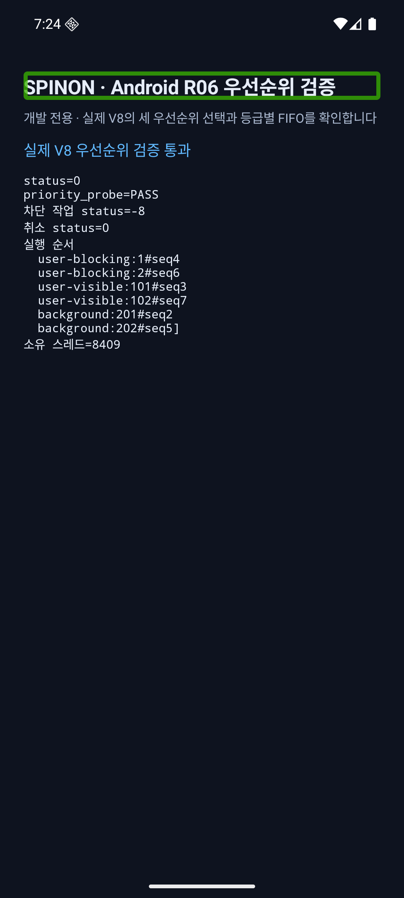
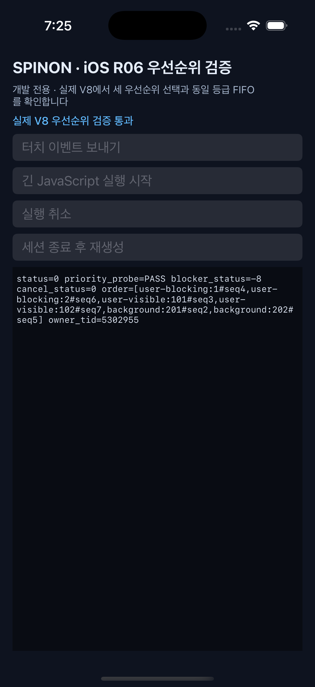

# R06 실제 V8 우선순위 선택 검증

**일자:** 2026-09-30 · **검증 범위:** Android 에뮬레이터와 iOS 시뮬레이터의 실제 V8 Isolate에서 세 우선순위의 다음 작업 선택 및 등급별 FIFO · **결과:** 두 플랫폼 통과 · **실기기:** 사용 안 함

## 실행 환경과 명령

| 항목 | Android | iOS |
| --- | --- | --- |
| 장치 | Android 16 ARM64 `sdk_gphone64_arm64` 에뮬레이터 | iPhone 17 Pro 시뮬레이터 |
| OS·SDK | Android API 36 에뮬레이터 | iOS 26.2 Simulator SDK |
| V8 모드 | `v8_jitless=false` | `v8_jitless=false` |
| 빌드 | `mise exec -- bun run build:android` 성공 | `mise exec -- bun run build:ios-sim` 성공 |
| 실행 | `adb -s emulator-5554 shell am start -n dev.spinon.bootstrap/.MainActivity --ez spinon_priority_probe true` | `xcrun simctl launch --terminate-running-process ACA7BF91-E2D5-4CF7-909A-08D1AD95FF3D dev.spinon.bootstrap --spinon-priority-probe` |

저장소 루트의 `mise exec -- bun run verify:r06-priority:simulators` 명령은 두 앱을 빌드하고, 연결된 Android `emulator-*`와 부팅된 iOS 시뮬레이터에서 진단을 실행한다. 여러 대가 부팅된 경우 환경 변수로 대상을 지정한다. 실제 Android 기기 serial은 거부한다. 실제 기기 형식의 serial을 넣었을 때 빌드 전에 거부되는 것도 확인했다. 로그·빌드 출력·캡처는 무시 경로인 `build/spinon/priority-validation/<UTC 시각>/`에 저장한다. 이 명령도 Android 16 ARM64 에뮬레이터와 iPhone 17 Pro / iOS 26.2 시뮬레이터에서 통과했다.

## 확인 방법

검증기가 별도 `RuntimeSession`을 열고 실제 V8 Isolate에서 `while (true) {}` 작업 하나를 시작한다. 실행 중 상태가 된 것을 확인한 뒤 아래 여섯 작업을 의도적으로 낮은 우선순위부터 섞어 접수하고, 실행 중인 작업에 취소를 요청한다. 취소된 작업이 반환된 뒤 같은 Isolate에서 대기 작업이 선택된다.

| 접수 순서 | 등급 | 표식 | 런타임 sequence |
| ---: | --- | ---: | ---: |
| 1 | `background` | 201 | 2 |
| 2 | `user-visible` | 101 | 3 |
| 3 | `user-blocking` | 1 | 4 |
| 4 | `background` | 202 | 5 |
| 5 | `user-blocking` | 2 | 6 |
| 6 | `user-visible` | 102 | 7 |

각 작업은 실제 JavaScript에서 전역 실행 번호를 증가시키고 `spinon.createNode()`로 그 번호를 Rust 콜백에 전달한다. 검증기는 콜백 순번이 1부터 6까지 연속인지, 실행 순서가 우선순위 내림차순인지, 등급 안에서는 런타임 sequence 오름차순인지, 모든 콜백 thread가 같은 Isolate owner thread인지 확인한다. 이 표식은 일반 앱 API가 아닌 개발 전용 내부 진단 경로다.

## 결과

| 플랫폼 | 차단 작업·취소 | 실제 V8 콜백 실행 순서 | 판정 |
| --- | --- | --- | --- |
| Android 16 ARM64 에뮬레이터 | `blocker_status=-8`, `cancel_status=0` | `user-blocking:1#seq4`, `user-blocking:2#seq6`, `user-visible:101#seq3`, `user-visible:102#seq7`, `background:201#seq2`, `background:202#seq5` | 통과 |
| iPhone 17 Pro / iOS 26.2 시뮬레이터 | `blocker_status=-8`, `cancel_status=0` | `user-blocking:1#seq4`, `user-blocking:2#seq6`, `user-visible:101#seq3`, `user-visible:102#seq7`, `background:201#seq2`, `background:202#seq5` | 통과 |

양쪽 원본 로그 모두 `status=0 priority_probe=PASS`를 기록한다. 최신 반복 검증의 소유 thread ID는 Android `8409`, iOS `5302955`이며 플랫폼마다 다르다. 각 실행 안에서 검증기는 여섯 콜백의 thread ID가 모두 해당 Isolate의 소유 thread ID와 일치하는지 확인했다.

- Android 원본 로그: [r06-priority-android-emulator-2026-09-30.log](r06-priority-android-emulator-2026-09-30.log)
- Android 화면: 
- iOS 원본 로그: [r06-priority-ios-simulator-2026-09-30.log](r06-priority-ios-simulator-2026-09-30.log)
- iOS 화면: 

## 적대적 검토 5회

1. **접수 전에 blocker가 끝나 결과가 우연히 정렬됐는가?** 검증기는 런타임 `active` 상태를 확인한 뒤 여섯 작업을 모두 큐에 넣고 나서 취소를 요청한다. 통과 보고에서 blocker의 취소 상태 `-8`과 취소 요청 `0`도 확인했다.
2. **가짜 V8 선택기만 검사했는가?** Android JNI와 iOS Objective-C++가 Rust FFI 진단 경로를 호출하고, 앱에 포함된 실제 V8에서 각 JavaScript 작업을 평가했다. 테스트 더블은 이 실행 결과를 만들지 않는다.
3. **접수 순서를 실행 순서로 잘못 읽었는가?** 실행 번호는 JS 전역 counter를 증가시킨 뒤 V8→Rust 콜백으로 전달된다. 검증기는 실제 콜백 번호가 1~6으로 연속인지도 확인한다.
4. **등급별 FIFO가 검증되지 않았는가?** 섞여 접수된 같은 등급 두 작업의 `sequence`를 비교했다. 실제 콜백은 각 등급 안에서 각각 `4→6`, `3→7`, `2→5` 순서로 실행됐다.
5. **플랫폼 선택·오래된 로그·기존 통과 결과 때문에 거짓 통과하지 않는가?** Android 대상은 `emulator-*` 및 ARM64 ABI만 허용하고, iOS 대상은 명시적 UUID 또는 하나뿐인 부팅 시뮬레이터로 제한한다. Android logcat을 초기화하고 iOS는 새 실행 전에 live log stream을 시작한다. 45초 제한, 예상 순서 전체 문자열, 취소 상태, `owner_tid`를 각각 검사한다. 두 로그와 캡처를 별도 보관하고 실기기 동작을 추정하지 않는다.

## 해석과 미검증 범위

이번 결과는 활성 작업이 반환한 **다음 작업을 고르는 규칙**과 한 번의 혼합 큐 배치에서의 FIFO만 확인한다. 실행 중 JavaScript는 선점되지 않는다. 지속적으로 높은 우선순위 작업을 넣었을 때 `background`가 굶는지, 장시간 공정성, 큐 포화·역압력, 다중 producer 경쟁, 실행 시간·성능, 실기기 및 JITless 구성을 확인하지 않았다. 이번 요청 범위에서 제외한 항목이며, R06·제품 스케줄러 완료로 표시하지 않는다.
