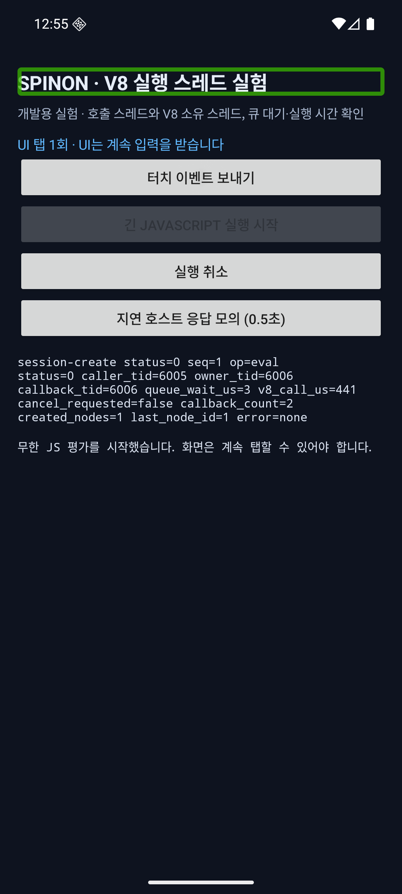
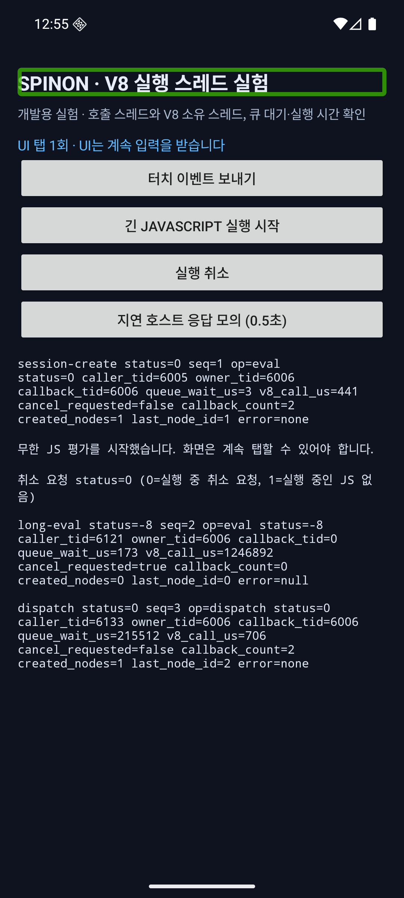
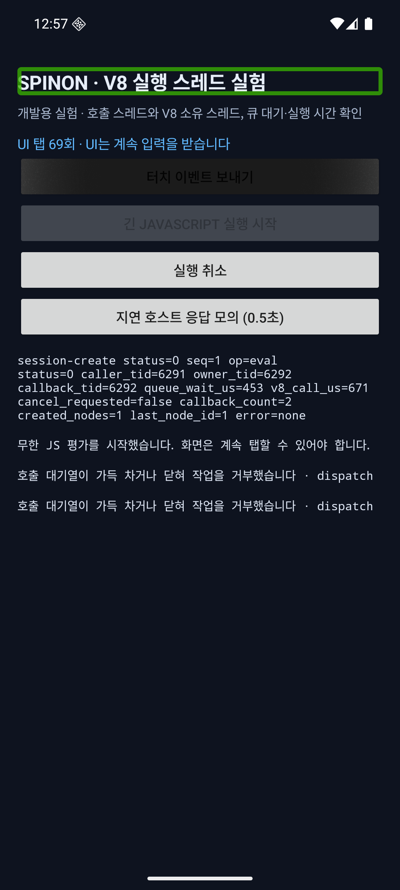
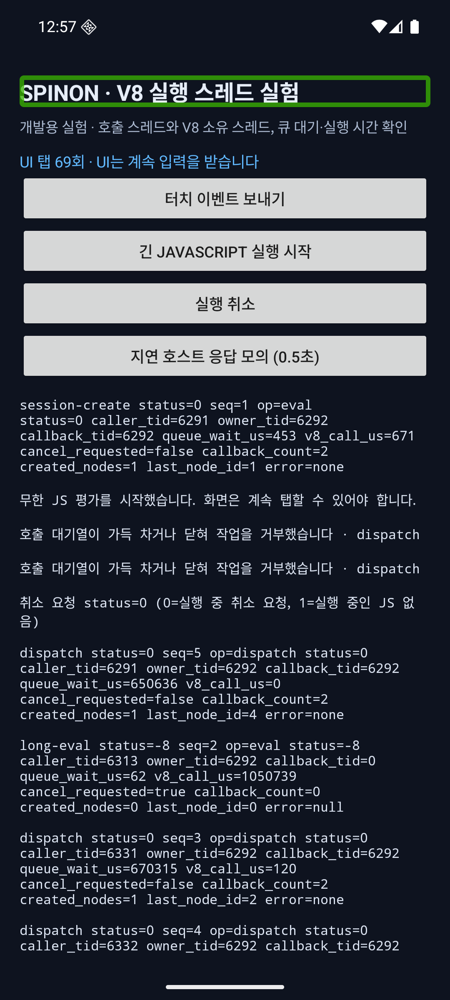
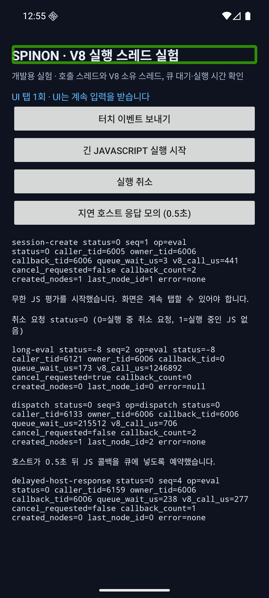
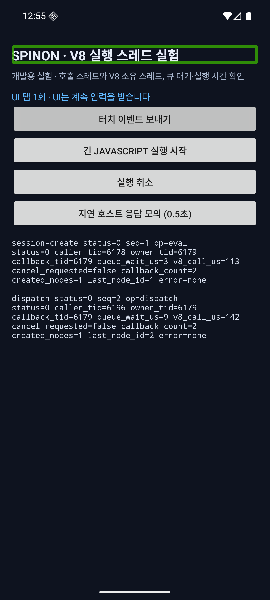
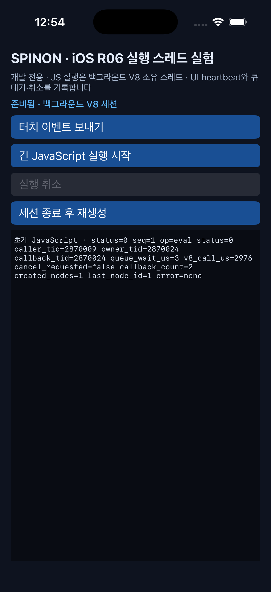
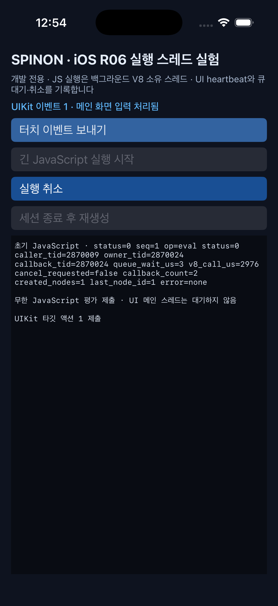
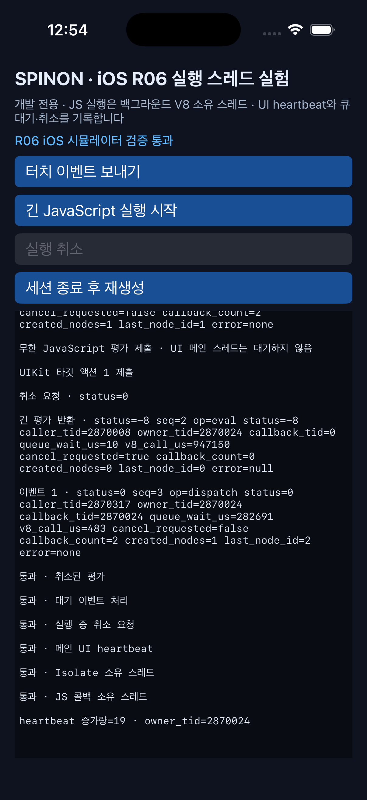
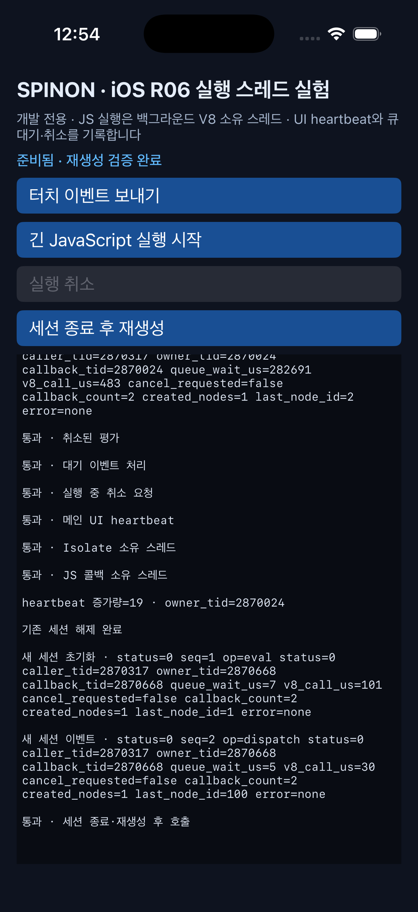

# R06 · V8 런타임 세션·스레드 실험 근거

**관찰 날짜:** 2026-09-30 · **브랜치:** `feat/r06-runtime-session` · **기준 커밋:** `57e132d` · **상태:** R06 미완료

## 실행한 검증

- `mise exec -- cargo fmt --all -- --check` — 통과.
- `mise exec -- cargo test --locked --workspace` — 총 31개 통과(spinon-core 15, spinon-ffi 8, style-layout 라이브러리 5, CLI 3). 새 런타임 세션 테스트는 가짜 V8 심볼로 호출자·소유자·콜백 thread ID 분리, 동일 소유자 유지, 취소 뒤 재사용, bounded queue 거부·배출을 검사한다. 이 테스트만으로 실제 V8 동작을 증명하지 않는다.
- `mise exec -- bun run build:android` — Gradle `assembleDebug` 성공. Android ARM64 V8 공유 라이브러리와 앱을 빌드했다. NDK `27.1.12297006`, 고정 V8 커밋 `7b50b62cb18f28617959e8452e2cd18195b38bcf`, `v8_jitless=false`를 사용했다.
- `bash tools/build-ios-native.sh` — iOS Simulator ARM64 Rust 정적 라이브러리와 C++ 어댑터 크로스 컴파일 성공.
- `mise exec -- bun run build:ios-sim` — Xcode 26.2 / iOS 26.2 Simulator SDK 앱 빌드 성공. 시뮬레이터 V8은 `v8_jitless=false`다. 정적 아카이브의 중복 debug-map 이름 경고가 있었지만 빌드는 성공했다.
- APK: `platforms/android/app/build/outputs/apk/debug/app-debug.apk`, 82,281,986바이트(약 78.5 MiB), SHA-256 `fa3d82b262bcbe58f239044264f4669939e225b8c61fce9ff1c960c58bf69ede`.
- `git diff --check` — 통과.

## 적대적 검증 5회

1. **작업 범위와 기준 브랜치:** 더티 `feat/taffy-r10-experiment`의 변경을 그대로 PR에 올리면 R08/R13 기반을 되돌리거나 R06 외 변경을 섞을 수 있고, 근거 문서는 과거 브랜치·커밋을 가리키고 있었다. `origin/main`의 `57e132d`에서 별도 `feat/r06-runtime-session`을 만들고 병합 기준을 확인했다. 근거 문서의 브랜치·기준 커밋을 고쳤으며, main의 R08/R13 파일은 보존한다.
2. **큐 용량과 부하 주장:** Rust Isolate 큐, Android 플랫폼 작업 대기열, iOS 접수 제한을 하나의 “64개 큐”로 오해할 문구가 있었다. 내부 명세에 세 경계를 분리해 적었다. Android는 4개 동기 FFI 작업자와 최대 64개 플랫폼 대기 작업, Rust는 실행 중 작업과 별도로 최대 64개 대기 명령을 가진다. iOS는 semaphore가 진행 중·대기 중 호출을 합해 64개로 제한한다. 에뮬레이터에서 70회 탭을 주입한 결과 화면 카운터는 69, 플랫폼 거부는 2회, V8 dispatch 성공은 67회였다. Rust 런타임 큐가 찼다는 로그는 없으며 iOS 대기열 포화도 실험하지 않았다.
3. **취소 직후 재사용:** 초기 설명은 가짜 엔진 테스트만으로 한정되어 실제 V8 재사용 검증을 놓쳤다. Android 16 에뮬레이터와 iOS 26.2 시뮬레이터 원본 로그에서 무한 JS 평가 `status=-8` 뒤 대기 dispatch `status=0`, 동일 세션 owner thread를 재확인했다. 두 플랫폼 모두 세션 종료 뒤 새 세션의 eval·dispatch 성공도 확인했다. 이를 근거와 명세에 반영했다. JITless iOS와 실기기는 여전히 확인하지 않았다.
4. **해제 경쟁과 UI 응답:** 세션 `free`가 진행 중인 플랫폼 FFI 호출보다 먼저 실행되거나 취소 타임아웃이 완료처럼 표시되는 경로를 재검토했다. Android는 취소 후 호출 풀 종료를 기다린 뒤 해제하고, iOS는 `DispatchGroup` drain 뒤 해제·재생성하도록 구성되어 있다. iOS watchdog은 취소만 요청하며 JS 반환 전에 시나리오를 끝내지 않는다. 두 환경에서 취소 후 UI 응답·대기 이벤트·세션 재생성을 확인했다. 대기 시간 제한과 강제 종료 복구는 구현·검증되지 않았다.
5. **문서·시각 증거의 사실성:** 예전 Android 13.45초·iOS 482ms, 오래된 캡처 파일명, “실기기 로그 필요”라는 표현이 현재 실험과 맞지 않았다. 현재 원본 로그에서 단일 관찰 대기값 Android 215,512µs, iOS 282,691µs를 읽어 상태표를 갱신하고 화면 링크를 실제 파일명으로 바꿨다. 각 값은 성능 벤치마크가 아니다. 에뮬레이터 압력 화면의 초록 제목 테두리는 활성 TalkBack 포커스 표시라 앱 레이아웃 테두리로 주장하지 않는다. R06은 미완료로 유지하고, 이 PR은 GitHub Pages를 배포하지 않으며 PR 본문에는 Tailscale 링크를 넣지 않는다.

## Android 16 ARM64 에뮬레이터

실기기가 연결되지 않아 Android Emulator `36.5.11.0`, Android 16(API 36), AVD `zl_poc`에서 앱을 실행했다. 에뮬레이터 그래픽은 `llvmpipe` 소프트웨어 Vulkan 드라이버(`lavapipe`)다. 이 결과는 UI 반응·실행기 제어 흐름 증거이며 실기기 성능 측정이 아니다.

- 기본 시작 로그는 `SPINON_BOOTSTRAP_EXECUTION is_main_thread=false`와 `SPINON_BOOTSTRAP_RESULT=nodes=2 last_node=8 tag=text text=이벤트:7`을 기록했다.
- 일반 R06 실행에서 V8 소유·콜백은 `owner_tid=6006`으로 일치했다. 무한 평가 중 UI 탭을 받고 별도 취소를 통해 eval `status=-8`을 확인했다. 대기 이벤트는 취소 뒤 `status=0`으로 처리됐다. 그 이벤트의 `queue_wait_us=215512`는 이 한 번의 실행 관찰값이다.
- 같은 Isolate에서 취소 후 이벤트 및 지연 호스트 응답이 성공했다. Activity를 닫을 때 취소와 `SPINON_RUNTIME_SESSION_FREE done`을 확인했고, 다시 열었을 때 새 세션의 owner thread에서 이벤트가 성공했다.
- 부하 시나리오에서는 무한 평가 중 adb로 UI 탭 70회를 주입했다. 화면에 `UI 탭 69회`가 표시됐고 플랫폼 실행 대기열 포화 거부 2건과 성공 dispatch 67건이 기록됐다. 취소 후 대기 작업을 배출하고 Activity 종료와 세션 해제를 마쳤다. 이는 Android 플랫폼 대기열 포화다. Rust의 내부 64개 대기 명령 큐 포화를 뜻하지 않는다.

원본 로그 파일: `r06-android-emulator-2026-09-30.log` · `r06-android-queue-pressure-2026-09-30.log` (저장소의 같은 evidence 폴더)

## iPhone 17 Pro / iOS 26.2 시뮬레이터

시뮬레이터 UUID `ACA7BF91-E2D5-4CF7-909A-08D1AD95FF3D`에서 실제 앱과 R06 화면을 실행했다. 실기기 결과는 아니다.

- 기본 앱 시작은 `SPINON_BOOTSTRAP_EXECUTION is_main_thread=false` 및 기본 번들 이벤트 성공을 기록했다.
- `idb ui tap`으로 이벤트·긴 평가·취소 컨트롤을 직접 눌렀다. 긴 평가는 `status=-8`, 대기 이벤트는 `status=0`으로 반환했고 main UI heartbeat는 19회 증가했다. eval·dispatch의 owner는 `2870024`, JS 콜백도 `2870024`에서 실행됐다.
- 대기 이벤트의 `queue_wait_us=282691`은 단일 시뮬레이터 실행값이다. 반복 성능 측정이 아니다.
- 수동 검증 뒤 기존 세션 해제를 확인하고 새 세션에서 eval·dispatch 성공과 새 owner `2870668`을 확인했다.
- iOS 개발 화면은 동시 queue와 전체 접수 수 64개 semaphore를 쓴다. iOS 플랫폼 대기열 포화는 측정하지 않았다. 시뮬레이터 V8은 `v8_jitless=false`; 실기기 JIT 정책·메모리·성능·GPU 렌더링은 검증하지 않았다.

원본 OS 로그 파일: `r06-ios-simulator-2026-09-30.log` (저장소의 같은 evidence 폴더)

## 범위와 미해결 항목

이 실험은 런타임 스레드 소유권과 기본 취소·해제 제어 흐름의 PoC다. 제품 API나 React Native·ReactLynx보다 빠르다는 주장을 제공하지 않는다. R06을 완료로 표시하지 않는다.

- 실기기 실행, iOS JITless V8, 공유 스레드 풀과 세션별 스레드의 메모리·공정성·head-of-line 비교는 남아 있다.
- Rust 내부 큐 포화의 실제 V8 부하, iOS 플랫폼 큐 포화, 우선순위·이벤트 병합·backpressure 정책, 취소·해제 시간 제한은 미검증이다.
- `HostDocument` 소유권, UI commit/revision 경계, 비동기 Promise·Fetch 수명, 강제 종료 복구, 메모리 부족·panic·C++ 예외의 복구와 오류 보존은 미정이다.
- 에뮬레이터·시뮬레이터 queue 대기 시간은 기기 성능 지표로 사용하지 않는다.
