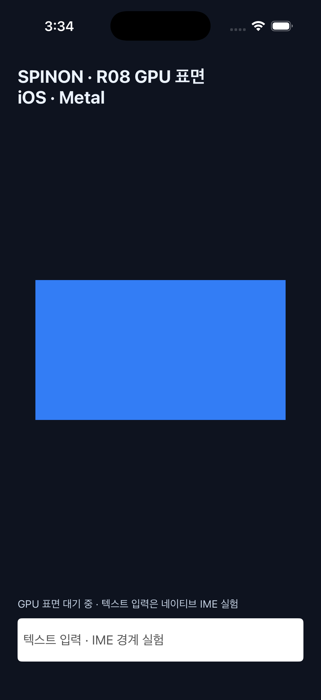
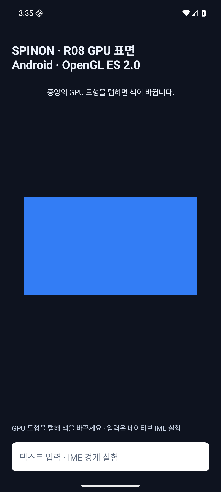
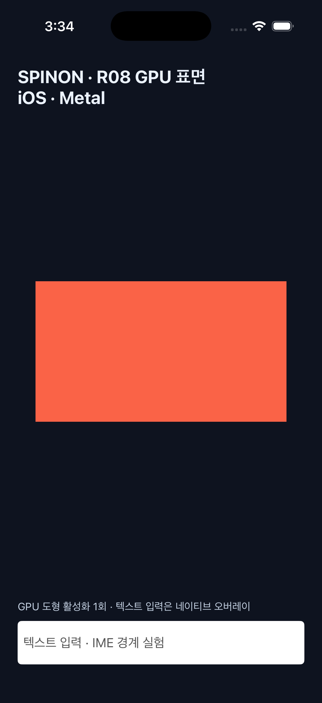
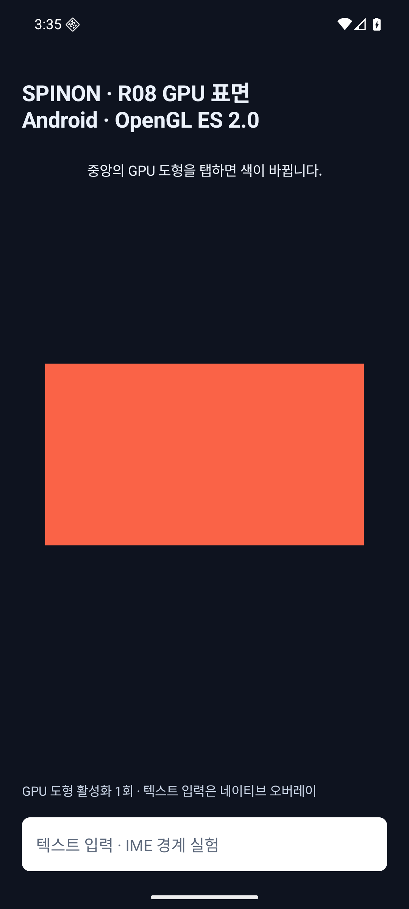
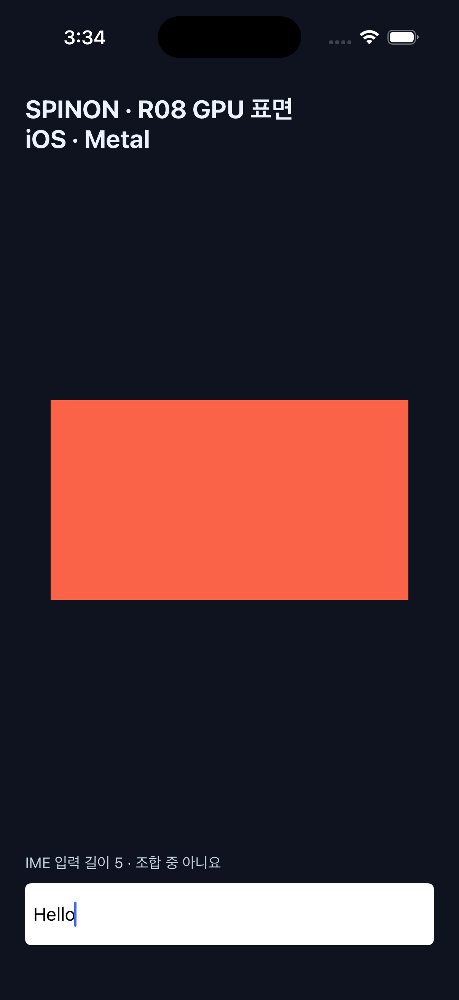
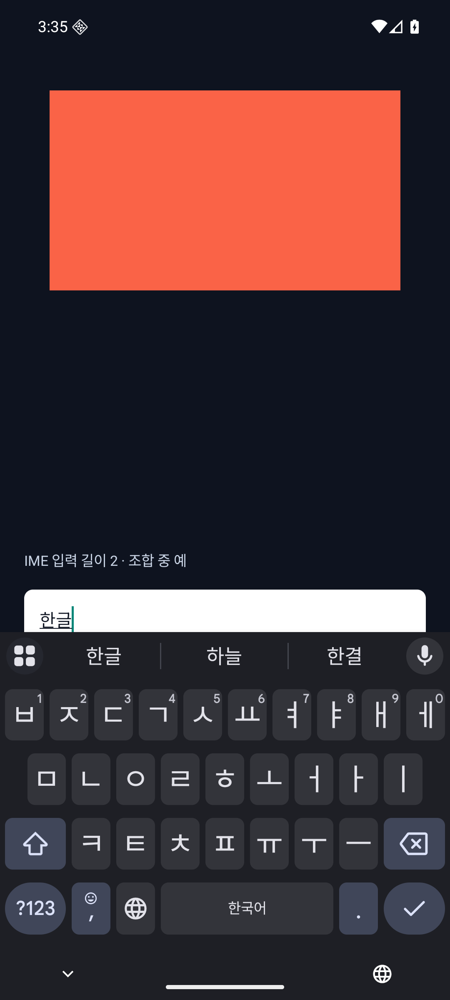

# R08 GPU 출력 위험 실험 기록

**판정:** 시뮬레이터 부분 실험 완료 · **R08 미완료** · 제품 렌더러 선택 근거로 사용하지 않음

Android와 iOS에서 최소 GPU 사각형, 플랫폼 입력, 접근성 요소 연결을 확인했습니다. 두 앱 모두 개발 전용 실행 인수로 실험 화면에 진입합니다. 앱 UI 트리, CSS 계산, Rust 코어와 연결하지 않았고 GPU에는 단색 사각형 하나만 제출합니다.

## 환경과 빌드

| 환경 | 렌더 경로 | 화면 크기 | 빌드 결과 |
| --- | --- | ---: | --- |
| iPhone 17 Pro 시뮬레이터, iOS 26.2 | `MTKView`·Metal | 402×874 point, drawable 1206×2622 pixel | `mise exec -- bun run build:ios-sim` 성공 |
| Android 에뮬레이터 `sdk_gphone64_arm64`, API 36 | `GLSurfaceView`·OpenGL ES 2.0 셰이더 | 1080×2400 pixel, 밀도 2.625, 약 411.43×914.29 dp | `mise exec -- bun run build:android` 성공 |

Android 에뮬레이터는 ANGLE을 거쳐 Vulkan 1.3 SwiftShader로 렌더링했습니다. 소프트웨어 렌더러 결과이므로 Android 실기기의 GPU 동작이나 성능을 대표하지 않습니다. iOS도 시뮬레이터만 사용했습니다. USB로 연결된 SM-S731N은 화면이 잠금 상태여서 설치·실행하지 않았고, iOS 실기기는 연결하지 않았습니다.

## 화면과 동작

GPU 사각형의 가시 영역과 터치 판정 및 접근성 버튼 경계를 같은 정규화 사각형으로 맞췄습니다. Android는 `AccessibilityNodeInfo`의 화면 경계를 표면 크기에서 계산하고, iOS는 `accessibilityFrame`을 GPU 사각형에 맞춥니다. 탭하면 플랫폼 UI 스레드에서 횟수를 바꾸고 Android의 렌더 스레드 또는 Metal draw 제출에 새 색을 전달합니다.

| iOS Metal | Android OpenGL ES |
| --- | --- |
|  |  |
|  |  |

텍스트와 입력 상자는 양쪽 모두 네이티브 UI입니다. GPU가 글리프를 그리거나 텍스트 shaping·줄바꿈을 처리한 결과가 아닙니다.

| iOS 네이티브 입력 | Android 한글 IME 입력 |
| --- | --- |
|  |  |

## 확인 결과

- **GPU 표면:** iOS Metal pipeline과 Android ES 2.0 shader가 생성되고 첫 draw가 제출됐습니다. 로그의 `first_draw_submitted`는 실제 화면 표시 완료 시각이 아닙니다.
- **터치:** 양쪽 시뮬레이터에서 중앙 사각형 탭 뒤 색과 활성화 횟수가 변했습니다. Android 화면 좌표 `(540, 1200)`, iOS simulator 좌표 `(201, 437)`을 사용했습니다.
- **텍스트·IME:** Android 에뮬레이터 Gboard 한글 키보드에서 `한글`을 조합해 입력했습니다. `TextWatcher`에서 `composing=true`가 관찰됐고 Enter 키 이벤트 뒤 입력은 `한글 `(공백 포함)로 확정되며 `composing=false`가 됐습니다. iOS `UITextField`는 `Hello` 입력을 받았고 `markedTextRange` 상태를 기록했습니다. iOS 한글 조합은 검증하지 못했습니다. 사용한 `idb ui text`가 한글 키 입력 코드가 없어 입력을 거부했습니다.
- **접근성 트리:** Android UIAutomator에서 GPU 표면이 `Button`, 입력이 `EditText`로 노출됐습니다. iOS 접근성 조회에서 GPU 표면은 `Button`, 입력은 `TextField`로 노출됐습니다. VoiceOver/TalkBack의 실제 읽기·초점 이동·접근성 활성화 동작은 확인하지 않았습니다.
- **키보드 표시 중 Android:** 창 크기가 줄어도 GPU 버튼 경계가 새 표면 크기에 맞춰 다시 계산됐습니다. 회전·백그라운드 복귀·GPU 자원 손실 복구는 다루지 않았습니다.

## 로그 발췌

Android 에뮬레이터:

```text
SPINON_R08_SURFACE=created api=OpenGL_ES_2 renderer=Android Emulator OpenGL ES Translator (ANGLE (Google, Vulkan 1.3.0 (SwiftShader Device ...)))
SPINON_R08_SHADER=ready
SPINON_R08_SURFACE=size 1080x2400
SPINON_R08_FRAME=first_draw_submitted
SPINON_R08_TOUCH count=1
SPINON_R08_TEXT_INPUT length=1 composing=true
SPINON_R08_TEXT_INPUT length=2 composing=true
SPINON_R08_TEXT_INPUT length=2 composing=false
```

iOS 시뮬레이터:

```text
SPINON_R08_METAL=ready device=Apple iOS simulator GPU
SPINON_R08_UI=ready text-input=UITextField accessibility=button+UITextField
SPINON_R08_SURFACE=size 1206x2622
SPINON_R08_FRAME=first_draw_submitted
SPINON_R08_TOUCH count=1
SPINON_R08_TEXT_INPUT length=1 composing=false
SPINON_R08_TEXT_INPUT length=5 composing=false
```

접근성 조회에서 확인한 iOS 버튼 경계는 `x=44.22, y=349.6, width=313.56, height=174.8 point`이며, GPU 사각형의 11%·40% 위치와 78%·20% 크기입니다. Android 초기 화면에서 UIAutomator가 읽은 버튼 경계는 `[119,960][961,1440]`이며 같은 비율입니다.

## 오류와 수명 경계

| 경계 | 현재 코드의 동작 | 실험에서 확인하지 않은 것 |
| --- | --- | --- |
| iOS Metal 준비 | 기본 Metal 장치·명령 큐·셰이더·pipeline 생성 실패를 로그에 남깁니다. 준비되지 않은 pipeline에서는 draw가 화면 제출 없이 돌아옵니다. | 장치/셰이더 오류 주입, 화면상 오류 복구, 재시도와 fallback |
| Android GLES 준비 | shader compile/link 실패는 `IllegalStateException`으로 GL 렌더러 경로에서 올라옵니다. 화면 오류 UI나 대체 렌더 경로는 없습니다. | 실패 주입과 앱 프로세스의 실제 종료 여부 |
| 표면·자원 수명 | Android `onSurfaceCreated`에서 shader program을 다시 생성합니다. iOS `MTKView` drawable을 받아 frame을 제출하고 화면 재배치 뒤 `draw()`를 요청합니다. | 회전, background/foreground, GPU 자원 손실, 장시간 실행과 누수 |
| 입력 오류·취소 | 사각형 바깥의 터치는 활성화하지 않습니다. 텍스트 입력은 OS 위젯에 남고 Rust/V8으로 전달하지 않습니다. | pointer cancel·drag, selection·clipboard, 이벤트 취소와 JavaScript 전달 |

이 표는 코드를 읽어 적은 실패 경로이며, 성공 로그·화면 이외의 오류 동작을 실험으로 입증하지 않습니다.

## 재현 명령

```sh
mise exec -- bun run build:android
adb -s emulator-5554 install -r platforms/android/app/build/outputs/apk/debug/app-debug.apk
adb -s emulator-5554 shell am start -n dev.spinon.bootstrap/.MainActivity --ez spinon_r08 true
adb -s emulator-5554 shell input tap 540 1200
adb -s emulator-5554 shell uiautomator dump /sdcard/r08-window.xml

SPINON_V8_DIR="$PWD/build/v8-source/v8" mise exec -- bun run build:ios-sim
xcrun simctl install ACA7BF91-E2D5-4CF7-909A-08D1AD95FF3D build/spinon/DerivedData/Build/Products/Debug-iphonesimulator/SpinonBootstrap.app
xcrun simctl launch ACA7BF91-E2D5-4CF7-909A-08D1AD95FF3D dev.spinon.bootstrap --spinon-r08
idb ui describe-all --udid ACA7BF91-E2D5-4CF7-909A-08D1AD95FF3D
idb ui tap --udid ACA7BF91-E2D5-4CF7-909A-08D1AD95FF3D 201 437
```

## 미완료 범위

R08은 **실기기 검증을 포함한 상태 대장의 실험 항목으로 미완료**입니다. Android 실기기와 iOS 실기기에서 표면 생성·입력·접근성을 재확인하고, iOS 한글 조합 입력과 VoiceOver/TalkBack 상호작용을 검증해야 합니다. 프레임 제출부터 실제 화면 표시까지의 계측, GPU 글꼴·이미지·클리핑·스크롤, 회전과 복귀 후 표면 복구도 이 실험에서 검증하지 않았습니다. 수명·표면 복구는 후속 R13 범위입니다.
