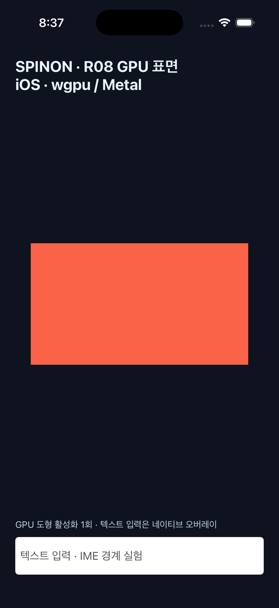
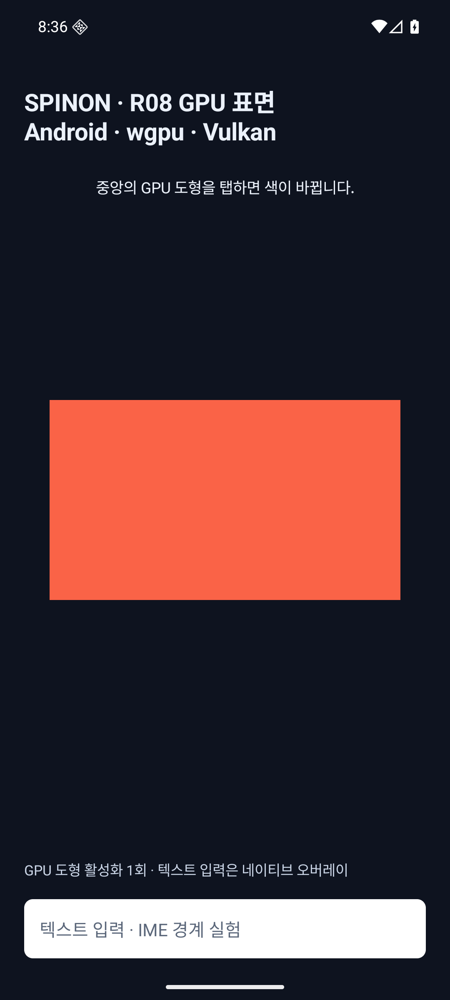
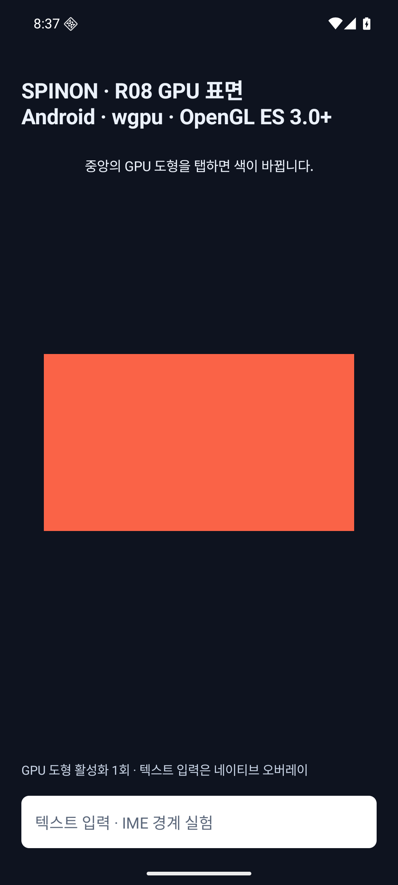

# R08 wgpu GPU 출력 위험 실험 기록

**판정:** 시뮬레이터·에뮬레이터 부분 실험 완료 · **R08 미완료** · 모바일 GPU API로 `wgpu`를 선택했으며 제품 렌더러 완료를 뜻하지 않음

Android와 iOS에서 같은 Rust `wgpu` 30.0.1 코드로 단색 사각형을 출력했습니다. Android는 백엔드 인수 없이 실행하면 Vulkan을 선택했고, OpenGL ES 백엔드는 비교를 위해 실험 인수로 강제했습니다. iOS는 Metal 백엔드로 실행했습니다. 앱 UI 트리·CSS·레이아웃·텍스트 렌더링과 연결하지 않았습니다. 네이티브 텍스트 입력·IME와 접근성 버튼은 플랫폼 오버레이입니다.

## 환경과 빌드

| 환경 | 렌더 경로 | 화면 크기 | 결과 |
| --- | --- | ---: | --- |
| iPhone 17 Pro 시뮬레이터, iOS 26.2 | `wgpu`·Metal | 402×874 point, 표면 1206×2622 pixel | `mise exec -- bun run build:ios-sim` 성공, 앱 실행·첫 프레임 제출·GPU 도형 탭 확인 |
| Android 에뮬레이터 `sdk_gphone64_arm64`, API 36 | `wgpu`·Vulkan 기본 실험 경로 | 1080×2400 pixel | `mise exec -- bun run build:android` 성공, 인수 없이 실행·첫 프레임·탭 확인 |
| 같은 Android 에뮬레이터 | `wgpu`·OpenGL ES 3.0 이상 비교 경로 | 1080×2400 pixel | 같은 빌드에서 실험 인수로 백엔드를 강제해 실행, 첫 프레임·탭 확인 |

Android Vulkan 어댑터는 `SwiftShader Device`로 표시된 CPU 소프트웨어 렌더러였습니다. `wgpu` GLES 경로는 ANGLE을 거쳐 Vulkan SwiftShader에서 실행됐습니다. 직접 GLES 2.0 비교 경로도 에뮬레이터에서는 ANGLE·SwiftShader를 사용했습니다. 이 환경은 Android 실기기 GPU나 성능을 대표하지 않습니다. iOS 결과도 시뮬레이터에 한정됩니다.

## 화면과 동작

| iOS 시뮬레이터 · wgpu Metal | Android 에뮬레이터 · wgpu Vulkan | Android 에뮬레이터 · wgpu GLES |
| --- | --- | --- |
|  |  |  |

동일한 사각형과 색상 전환을 확인했습니다. Android에서는 두 백엔드 모두 중앙 탭 뒤 `SPINON_R08_TOUCH count=1` 로그가 나왔습니다. iOS에서도 시뮬레이터 중앙 도형을 탭한 뒤 `SPINON_R08_WGPU_TOUCH count=1` 로그와 접근성 값 `활성화 1회`를 확인했습니다. 이는 시뮬레이터 자동화 결과이며 VoiceOver 동작 검증은 아닙니다.

Android UIAutomator에서 GPU 영역은 `android.widget.Button`(화면 bounds `[119,960][961,1440]`), 텍스트 입력은 `android.widget.EditText`로 보였습니다. iOS `idb` 조회에서는 GPU 영역이 `AXButton`(frame `{{44.22,349.6},{313.56,174.8}}`), 입력이 `AXTextField`였습니다. 접근성 요소 노출과 자동화된 활성화는 확인했지만 TalkBack·VoiceOver의 실제 탐색·음성 출력은 확인하지 않았습니다.

## 구현 경계와 관찰

- Android 네이티브 표면은 `ANativeWindow`로 가져오고, iOS 표면은 `UIView`의 `CAMetalLayer`를 사용합니다. 플랫폼 표면 수명과 핸들 변환 코드는 남습니다.
- Rust 렌더 코드·WGSL 셰이더·pipeline·프레임 제출은 Android와 iOS에서 공유합니다. 현재 데모는 Android에서 Vulkan을 기본 선택하고 GLES를 실험 인수로 강제합니다. 제품의 자동 선택·실패 시 대체 순서는 아직 구현하지 않았습니다. 고정한 wgpu 지원표는 Vulkan을 우선 지원, GLES 3.0 이상을 최선 노력 지원으로 분류합니다.
- 표면에서 프레임을 얻지 못하면 오류 코드를 기록하고 그 프레임 제출을 중단합니다. `Lost`·`Outdated` 표면이나 장치 손실을 재생성·복구하지 않으며 오류 주입도 하지 않았습니다. Android 표면 파괴 시 렌더러를 정리하고 iOS 뷰 해제 때 정리하지만, 재생성·복귀 동작은 아직 검증하지 않았습니다.
- 에뮬레이터에서 Vulkan·Metal 표면의 기본 sRGB 포맷을 사용하면 기존 직접 렌더 경로와 색이 달라졌습니다. 비교에서는 지원되는 비 sRGB 포맷을 선택해 색상 표현을 맞췄습니다. 제품 색상 공간과 변환 규칙은 별도 결정이 필요합니다.
- iOS 시뮬레이터는 wgpu 기본 device limit보다 낮은 셰이더 한도를 보고했습니다. 장치가 지원하는 limit을 요청하도록 바꾼 뒤 device와 첫 프레임 생성이 성공했습니다.
- 현재 Android 표면 생성·그리기와 iOS 뷰 레이아웃·그리기 호출은 UI 스레드에서 동기 실행합니다. 시작 지연, 프레임 지연, 별도 렌더 스레드 구조를 검증한 결과가 아닙니다.
- wgpu 경로는 색상이 있는 사각형 한 개만 그립니다. 텍스트·이미지·클리핑·합성·스크롤·트리 장면 연결은 없습니다.

## 로그 발췌

Android Vulkan:

```text
SPINON_R08_WGPU=ready backend=Vulkan device=Cpu name=SwiftShader Device (LLVM 10.0.0) format=Rgba8Unorm supported_formats=[Rgba8UnormSrgb, Rgba8Unorm, Rgba16Float, Rgb10a2Unorm]
SPINON_R08_WGPU_SURFACE=size 1080x2400
SPINON_R08_TOUCH count=1
```

Android OpenGL ES:

```text
SPINON_R08_WGPU=ready backend=Gl device=Cpu name=Android Emulator OpenGL ES Translator (ANGLE ... Vulkan 1.3.0 SwiftShader ...) format=Rgba8Unorm
SPINON_R08_WGPU_SURFACE=size 1080x2400
SPINON_R08_TOUCH count=1
```

iOS Metal:

```text
SPINON_R08_WGPU=ready backend=Metal device=DiscreteGpu name=Apple iOS simulator GPU format=Bgra8Unorm supported_formats=[Bgra8UnormSrgb, Bgra8Unorm, Rgba16Float]
SPINON_R08_WGPU_SURFACE=size 1206x2622
SPINON_R08_WGPU_FRAME=first_draw_submitted
SPINON_R08_WGPU_TOUCH count=1
```

`first_draw_submitted`는 GPU 프레임 제출 로그이며 실제 화면 표시 시각을 측정한 값이 아닙니다.

## 재현 명령

```sh
mise exec -- bun run build:android
adb -s emulator-5554 install -r platforms/android/app/build/outputs/apk/debug/app-debug.apk
adb -s emulator-5554 shell am start -n dev.spinon.bootstrap/.MainActivity --ez spinon_r08 true
adb -s emulator-5554 shell input tap 540 1200

adb -s emulator-5554 shell am force-stop dev.spinon.bootstrap
adb -s emulator-5554 shell am start -n dev.spinon.bootstrap/.MainActivity --ez spinon_r08 true --ei spinon_r08_backend 2

mise exec -- bun run build:ios-sim
xcrun simctl install ACA7BF91-E2D5-4CF7-909A-08D1AD95FF3D build/spinon/DerivedData/Build/Products/Debug-iphonesimulator/SpinonBootstrap.app
xcrun simctl launch ACA7BF91-E2D5-4CF7-909A-08D1AD95FF3D dev.spinon.bootstrap --spinon-r08
```

직접 API 비교 경로는 Android `--ez spinon_r08_native true`, iOS `--spinon-r08-native`로 실행합니다. 이 경로는 기준 화면 비교용이며 제품 fallback으로 정하지 않았습니다.

## 미완료 범위

R08은 **실기기 검증을 포함한 상태 대장의 실험 항목으로 미완료**입니다. Android·iOS 실기기 표면 생성, iOS 한글 조합, VoiceOver/TalkBack 동작, Android 백엔드 탐지·대체 순서, 표면 파괴·재생성, 회전·백그라운드 복귀, GPU 자원 손실, 장시간 실행, 메모리와 실제 표시 시각은 확인하지 않았습니다. 실제 앱 트리·텍스트·이미지 렌더링과 CSS·레이아웃 연결도 후속 구현 범위입니다.
