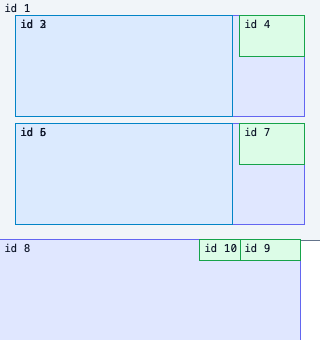

# S02 Taffy 레이아웃 연결 검증

**판정:** 구현 부분 완료 · **공식 상태:** S02 미완료 · **범위:** Rust 레이아웃 crate와 고정 브라우저 fixture

## 확인한 동작

`crates/spinon-layout`의 `LayoutInput::from_tree`가 `spinon-core::Tree`의 노드 ID·자식 순서·구조 revision을 계산 스타일 맵과 묶어 snapshot으로 만듭니다. `LayoutEngine` 내부 인터페이스 뒤에서 Taffy가 전체 트리를 계산하고 절대 프레임과 입력 구조 revision을 반환합니다. Taffy 엔진 ID는 내부 맵에서만 사용하며 코어 `NodeId`를 결과 키로 보존합니다.

공유 HTML fixture는 7노드 LTR Flex 화면과 3노드 RTL 행을 정의합니다. Headless Chrome에서 각 서브트리의 루트 기준 `getBoundingClientRect()`를 읽고, 같은 JSON 입력을 Rust 테스트에서 읽습니다. 기존 `spikes/dynamic-tree/rust/tree.rs`의 C ABI도 동일한 7노드 fixture로 호출했습니다.

## 환경

| 항목 | 값 |
| --- | --- |
| 호스트 | macOS 26.5.1, Apple Silicon arm64 |
| Rust | `rustc 1.96.1 (31fca3adb 2026-06-26)` |
| 브라우저 | Headless Chrome 154.0.0.0 (`navigator.userAgent`) |
| 브라우저 viewport | 320×340 CSS px |
| LTR fixture 루트 | 320×240 CSS px |
| RTL fixture 루트 | 300×100 CSS px |
| Taffy | 정확히 `0.14.0`; `std`, `flexbox`, `taffy_tree` 기능만 활성화 |

브라우저는 `agent-browser`로 정적 HTML fixture를 열었습니다. 그 CLI가 띄운 Chromium의 관찰 버전이며 사용자에게 배포되는 브라우저 지원 계약은 아닙니다.

## 좌표 비교

모든 좌표는 fixture 루트 왼쪽 위 기준입니다. 브라우저 기준과 Taffy, 기존 작은 엔진의 최대 절대 차이는 이 입력에서 `0 CSS px`였고 허용치는 `0.5 CSS px`입니다. 기존 엔진 비교는 정수 길이로 제한된 공통 LTR fixture만 포함합니다. RTL은 브라우저와 Taffy 사이에서 확인했습니다.

| 노드 | 의미 | x | y | 너비 | 높이 |
| ---: | --- | ---: | ---: | ---: | ---: |
| 1 | 세로 루트 | 0 | 0 | 320 | 240 |
| 2 | 첫 가로 행 | 16 | 16 | 288 | 100 |
| 3 | 첫 행의 유연 영역 | 16 | 16 | 216 | 100 |
| 4 | 첫 행의 버튼 상자 | 240 | 16 | 64 | 40 |
| 5 | 둘째 가로 행 | 16 | 124 | 288 | 100 |
| 6 | 둘째 행의 유연 영역 | 16 | 124 | 216 | 100 |
| 7 | 둘째 행의 버튼 상자 | 240 | 124 | 64 | 40 |
| 8 | RTL 루트 | 0 | 0 | 300 | 100 |
| 9 | DOM 첫째 자식, 오른쪽 배치 | 240 | 0 | 60 | 20 |
| 10 | DOM 둘째 자식, 왼쪽 배치 | 200 | 0 | 40 | 20 |



## Rust 검증

```sh
mise exec -- cargo test -p spinon-layout
```

결과는 13개 통과, 실패 0개입니다. 7개 S02 테스트는 브라우저 기준 좌표, 보존 엔진의 같은 fixture, RTL 자식 순서, 소수 좌표 보존, 잘못된 그래프·스타일, 코어 트리 snapshot과 스타일 누락/오류를 확인합니다. 포함한 기존 PoC 모듈의 원래 단위 테스트 6개도 같은 실행에서 통과했습니다.

브라우저 관찰 재현:

```sh
agent-browser open file:///절대경로/spinon/crates/spinon-layout/tests/fixtures/s02-basic-flex.html
agent-browser set viewport 320 340
agent-browser eval 'JSON.stringify({ frames: window.spinonFrames(), rtlFrames: window.spinonRtlFrames() })'
```

캡처는 Headless Chrome 154 기준으로 저장했습니다. screenshot 크기는 320×340입니다.

전체 검사와 대상 검사:

```sh
mise exec -- cargo test --locked --workspace
mise exec -- cargo clippy -p spinon-layout --all-targets --no-deps -- -D warnings
mise exec -- cargo check -p spinon-layout --target aarch64-apple-ios-sim --locked
mise exec -- cargo check -p spinon-layout --target aarch64-linux-android --locked
SPINON_DOC_BASE=/spinon/docs/ mise exec -- bun run docs:build
```

Rust workspace 전체 테스트, 레이아웃 crate Clippy, iOS simulator/Android Rust target 교차 검사가 통과했습니다. RSPress `2.0.22` 문서 빌드도 통과했습니다. workspace 전체 Clippy는 기존 `spinon-core/src/tree.rs`의 `unnecessary_unwrap` 두 건에서 실패했습니다. 레이아웃 crate Clippy는 비교용으로 포함한 기존 PoC 모듈의 해당 lint만 모듈 범위에서 허용해 새 코드의 `-D warnings` 검사를 통과합니다.

## 적대적 검증 5회

1. **경계·revision:** 별도 트리 중복과 플랫폼 단위 오해 가능성을 찾았습니다. `LayoutInput::from_tree`가 코어의 자식 순서·revision을 가져오게 하고 필드를 private으로 바꾸어 복사한 스냅샷을 변경할 수 없게 했습니다. `Points`도 `Fixed`로 바꿨습니다. 출력 revision은 구조 revision만 식별하며 스타일 revision은 미정이라고 계약에 제한을 적었습니다. snapshot 생성과 계산에서 그래프 전체를 두 번 검증하지 않도록 전체 입력 검사는 계산 경계 한 곳에 뒀습니다.
2. **입력 손상·오류:** 중복 자식·복수 부모·루트 역참조·고립 노드·순환·NaN/무한대·음수 값의 처리와 실패 시 부분 프레임 미반환을 확인했습니다. 누락 스타일·알 수 없는 스타일 ID 및 결정적인 최초 고립 ID 테스트를 추가했습니다. Taffy 계산 panic 복구는 unwind 빌드에서만 가능하다고 명시했습니다.
3. **Flex 의미:** padding/gap 축 매핑, border-box, RTL 시작 방향, 소수 좌표, 기본 stretch, 무줄바꿈, shrink 비활성 동작을 브라우저 fixture와 대조했습니다. 자동 콘텐츠 측정과 CSS 기본 `flex-shrink: 1` 등은 구현하지 않아 지원 범위에서 제외했습니다.
4. **비교의 재현성:** Taffy·브라우저가 서로 다른 수치를 직접 복사하지 않도록 입력을 HTML 안 단일 JSON fixture로 공유했습니다. 브라우저의 LTR/RTL 프레임은 실제 DOM 측정값이며, Rust는 기록된 그 값에 0.5 CSS px 허용치를 적용합니다. 기존 PoC 비교는 정수 LTR fixture에만 한정하고 RTL 미지원도 검사합니다. 브라우저 측정은 CI 자동 실행이 아니라 수동 재현입니다.
5. **통합·완료 과장:** 의존 기능, Android/iOS 검사 범위, 문서 경로와 지원 상태를 확인했습니다. serde는 테스트 전용이고 Taffy 기능은 세 가지만 활성화됐습니다. 모바일 앱·FFI·GPU 경로를 연결한 것은 아니므로 S02 체크는 유지했습니다. 전체 workspace Clippy의 기존 두 오류도 새 crate와 분리해 기록했습니다.

## 제한과 남은 검증

이 결과는 해당 두 fixture의 기하 일치만 증명합니다. CSS 전체 Flexbox 적합성, 글꼴 shaping·intrinsic sizing, CSS px↔Android dp/iOS point 변환, iOS·Android 제품 경로 연결, 접근성·클리핑·스크롤, 동시 변경에서 stale style snapshot 회피, Taffy 부분 갱신, 처리 시간·메모리·모바일 바이너리 크기는 검증하지 않았습니다. 따라서 이 근거만으로 S02 또는 공개 CSS 지원을 완료 처리하지 않습니다.
