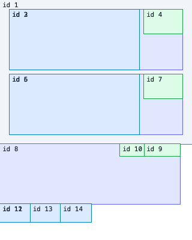

# S02 Taffy 레이아웃 연결 검증

**판정:** 구현 부분 완료 · **공식 상태:** S02 미완료 · **범위:** Rust 레이아웃 crate와 고정 브라우저 fixture

## 확인한 동작

`crates/spinon-layout`의 `LayoutInput::from_tree`가 `spinon-core::Tree`의 노드 ID·자식 순서·구조 revision을 계산 스타일 맵과 묶어 snapshot으로 만듭니다. `LayoutEngine` 내부 인터페이스 뒤에서 Taffy가 전체 트리를 계산하고 절대 프레임과 입력 구조 revision을 반환합니다. Taffy 엔진 ID는 내부 맵에서만 사용하며 코어 `NodeId`를 결과 키로 보존합니다.

공유 HTML fixture는 7노드 LTR Flex 화면, 3노드 RTL 행, 151.5 CSS px 컨테이너를 flex-grow 자식 셋으로 나누는 4노드 소수 분배 사례를 정의합니다. Headless Chrome에서 각 서브트리의 루트 기준 `getBoundingClientRect()`를 읽고, 같은 JSON 입력을 Rust 테스트에서 읽습니다. 기존 `spikes/dynamic-tree/rust/tree.rs`의 C ABI 비교는 정수 크기인 7노드 LTR fixture에만 적용했습니다.

## 환경

| 항목 | 값 |
| --- | --- |
| 호스트 | macOS 26.5.1, Apple Silicon arm64 |
| Rust | `rustc 1.96.1 (31fca3adb 2026-06-26)` |
| 브라우저 | Headless Chrome 154.0.0.0 (`navigator.userAgent`) |
| 브라우저 viewport | 320×340 CSS px |
| LTR fixture 루트 | 320×240 CSS px |
| RTL fixture 루트 | 300×100 CSS px |
| Taffy | 정확히 `0.14.0`; `std`, `flexbox`, `taffy_tree` 기능만 활성화 |

브라우저는 `agent-browser`로 정적 HTML fixture를 열었습니다. 그 CLI가 띄운 Chromium의 관찰 버전이며 사용자에게 배포되는 브라우저 지원 계약은 아닙니다.

## 좌표 비교

모든 좌표는 fixture 루트 왼쪽 위 기준입니다. 브라우저 기준과 Taffy, 기존 작은 엔진의 최대 절대 차이는 이 입력에서 `0 CSS px`였고 허용치는 `0.5 CSS px`입니다. 기존 엔진 비교는 정수 길이로 제한된 공통 LTR fixture만 포함합니다. RTL은 브라우저와 Taffy 사이에서 확인했습니다.

| 노드 | 의미 | x | y | 너비 | 높이 |
| ---: | --- | ---: | ---: | ---: | ---: |
| 1 | 세로 루트 | 0 | 0 | 320 | 240 |
| 2 | 첫 가로 행 | 16 | 16 | 288 | 100 |
| 3 | 첫 행의 유연 영역 | 16 | 16 | 216 | 100 |
| 4 | 첫 행의 버튼 상자 | 240 | 16 | 64 | 40 |
| 5 | 둘째 가로 행 | 16 | 124 | 288 | 100 |
| 6 | 둘째 행의 유연 영역 | 16 | 124 | 216 | 100 |
| 7 | 둘째 행의 버튼 상자 | 240 | 124 | 64 | 40 |
| 8 | RTL 루트 | 0 | 0 | 300 | 100 |
| 9 | DOM 첫째 자식, 오른쪽 배치 | 240 | 0 | 60 | 20 |
| 10 | DOM 둘째 자식, 왼쪽 배치 | 200 | 0 | 40 | 20 |
| 11 | 소수 분배 루트 | 0 | 0 | 151.5 | 30 |
| 12 | 첫째 flex-grow 자식 | 0 | 0 | 50.5 | 30 |
| 13 | 둘째 flex-grow 자식 | 50.5 | 0 | 50.5 | 30 |
| 14 | 셋째 flex-grow 자식 | 101 | 0 | 50.5 | 30 |


### 소수 Flex 분배 후속 비교 · 2026-10-01

너비 151.5 CSS px인 행에 크기·간격이 없는 자식 셋을 놓고 `flex-grow: 1`을 적용했습니다. Headless Chrome 154의 `getBoundingClientRect()`와 Taffy `0.14.0`의 출력은 모두 `(x, width) = (0, 50.5), (50.5, 50.5), (101, 50.5)`였습니다. 소수 fixture의 회귀 허용치는 `0.01 CSS px`로 두어 Taffy의 정수 경계 반올림이 다시 켜지면 실패하게 했습니다. 기존 PoC 엔진은 이 소수 분배 fixture를 지원하지 않아 비교하지 않았습니다.



## Rust 검증

```sh
mise exec -- cargo test -p spinon-layout
```

결과는 14개 통과, 실패 0개입니다. 8개 S02 테스트는 브라우저 기준 좌표, 보존 엔진의 정수 fixture, RTL 자식 순서, 151.5 CSS px 소수 Flex 분배, 소수 좌표 보존, 잘못된 그래프·스타일, 코어 트리 snapshot과 스타일 누락/오류를 확인합니다. 포함한 기존 PoC 모듈의 원래 단위 테스트 6개도 같은 실행에서 통과했습니다.

브라우저 관찰 재현:

```sh
agent-browser open file:///절대경로/spinon/crates/spinon-layout/tests/fixtures/s02-basic-flex.html
agent-browser set viewport 320 340
agent-browser eval 'JSON.stringify({ frames: window.spinonFrames(), rtlFrames: window.spinonRtlFrames(), fractionalFrames: window.spinonFractionalFrames() })'
```

LTR·RTL 캡처는 Headless Chrome 154 기준 320×340, 2026-10-01 소수 Flex 추가 캡처는 같은 브라우저 기준 320×400입니다.

전체 검사와 대상 검사:

```sh
mise exec -- cargo test --locked --workspace
mise exec -- cargo clippy -p spinon-layout --all-targets --no-deps -- -D warnings
mise exec -- cargo check -p spinon-layout --target aarch64-apple-ios-sim --locked
mise exec -- cargo check -p spinon-layout --target aarch64-linux-android --locked
SPINON_DOC_BASE=/spinon/docs/ mise exec -- bun run docs:build
```

Rust workspace 전체 테스트, 레이아웃 crate Clippy, iOS simulator/Android Rust target 교차 검사가 통과했습니다. 기존 PR 기준에서는 RSPress `2.0.22` 문서 빌드도 통과했습니다. 최신 `main` 재기반 후 문서 빌드 결과는 아래 별도 검증 기록을 참고합니다. workspace 전체 Clippy는 기존 `spinon-core/src/tree.rs`의 `unnecessary_unwrap` 두 건에서 실패했습니다. 레이아웃 crate Clippy는 비교용으로 포함한 기존 PoC 모듈의 해당 lint만 모듈 범위에서 허용해 새 코드의 `-D warnings` 검사를 통과합니다.

## 적대적 검증 5회

1. **경계·revision:** 별도 트리 중복과 플랫폼 단위 오해 가능성을 찾았습니다. `LayoutInput::from_tree`가 코어의 자식 순서·revision을 가져오게 하고 필드를 private으로 바꾸어 복사한 스냅샷을 변경할 수 없게 했습니다. `Points`도 `Fixed`로 바꿨습니다. 출력 revision은 구조 revision만 식별하며 스타일 revision은 미정이라고 계약에 제한을 적었습니다. snapshot 생성과 계산에서 그래프 전체를 두 번 검증하지 않도록 전체 입력 검사는 계산 경계 한 곳에 뒀습니다.
2. **입력 손상·오류:** 중복 자식·복수 부모·루트 역참조·고립 노드·순환·NaN/무한대·음수 값의 처리와 실패 시 부분 프레임 미반환을 확인했습니다. 누락 스타일·알 수 없는 스타일 ID 및 결정적인 최초 고립 ID 테스트를 추가했습니다. Taffy 계산 panic 복구는 unwind 빌드에서만 가능하다고 명시했습니다.
3. **Flex 의미:** padding/gap 축 매핑, border-box, RTL 시작 방향, 151.5px을 세 자식에 나누는 소수 좌표, 기본 stretch, 무줄바꿈, shrink 비활성 동작을 브라우저 fixture와 대조했습니다. 자동 콘텐츠 측정과 CSS 기본 `flex-shrink: 1` 등은 구현하지 않아 지원 범위에서 제외했습니다.
4. **비교의 재현성:** Taffy·브라우저가 서로 다른 수치를 직접 복사하지 않도록 입력을 HTML 안 단일 JSON fixture로 공유했습니다. LTR/RTL 브라우저 프레임은 실제 DOM 측정값이며, Rust는 기존 정수 fixture에 0.5 CSS px, 소수 Flex 분배에 0.01 CSS px 허용치를 적용합니다. 기존 PoC 비교는 정수 LTR fixture에만 한정하고 RTL·소수 Flex 분배는 지원하지 않아 비교에서 제외합니다. 브라우저 측정은 CI 자동 실행이 아니라 수동 재현입니다.
5. **통합·완료 과장:** 의존 기능, Android/iOS 검사 범위, 문서 경로와 지원 상태를 확인했습니다. serde는 테스트 전용이고 Taffy 기능은 세 가지만 활성화됐습니다. 모바일 앱·FFI·GPU 경로를 연결한 것은 아니므로 S02 체크는 유지했습니다. 전체 workspace Clippy의 기존 두 오류도 새 crate와 분리해 기록했습니다.

## 소수 Flex fixture 후속 적대적 검토 · 2026-10-01

1. **동일 입력 검증:** 브라우저와 Rust 테스트가 HTML 안 같은 JSON fixture를 읽는지 확인했습니다. 브라우저 측정 함수는 `expected` 값을 읽지 않고 실제 DOM 사각형만 읽습니다.
2. **Flex 축·축소 영향:** 루트 너비 151.5px, gap 0, 세 자식 `flex-grow: 1`로 고정했습니다. 남는 공간을 나누는 사례라 `flex-shrink` 기본값 차이와 내용 측정 영향을 배제합니다.
3. **반올림 회귀 감지:** `0.01 CSS px` 허용치를 적용해 Taffy 기본 정수 반올림의 0.5px 차이는 실패하도록 했고, 현재 `disable_rounding()` 결과는 Chrome 측정과 일치했습니다.
4. **좌표 원점 확인:** 화면 전체 좌표 대신 각 fixture 루트의 왼쪽 위를 원점으로 사용합니다. 소수 루트 너비와 최종 자식 오른쪽 경계가 일치하는지도 비교했습니다.
5. **주장 범위 확인:** 기존 작은 엔진은 이 소수 fixture를 지원하지 않으므로 비교 대상에서 제외했습니다. 수동 Headless Chrome 154 측정만 확인했으며 WebKit·Firefox, GPU 픽셀 coverage, 모바일 제품 경로 검증을 주장하지 않습니다.

## 제한과 남은 검증

이 결과는 세 fixture의 기하 일치만 증명합니다. 브라우저 비교는 Headless Chrome 한 엔진에 한정하며 WebKit·Firefox 차이는 확인하지 않았습니다. CSS 전체 Flexbox 적합성, 글꼴 shaping·intrinsic sizing, CSS px↔Android dp/iOS point 변환, iOS·Android 제품 경로 연결, 접근성·클리핑·스크롤, 동시 변경에서 stale style snapshot 회피, Taffy 부분 갱신, 처리 시간·메모리·모바일 바이너리 크기는 검증하지 않았습니다. 따라서 이 근거만으로 S02 또는 공개 CSS 지원을 완료 처리하지 않습니다.

## 최신 main 재기반 후 적대적 검토 5회 · 2026-10-01

재기반 기준은 `9507ad327e41647459a2badc1391d9651703abb0`입니다.

1. **명세 ID와 링크 충돌:** 최신 `main`에서 내부 명세 `0007`은 UA stylesheet, `0008`은 CSS 번들러 계약에 이미 사용 중임을 확인했습니다. 레이아웃 계약을 `0009-layout-engine.md`로 옮기고 내부 색인·상태 대장·아키텍처·구현 계획 링크를 함께 갱신했습니다.
2. **워크스페이스 통합:** 최신 `main`의 `spinon-style` 구성원을 보존하면서 `spinon-layout`을 추가하고 잠금 파일과 크레이트 의존 경계를 확인했습니다. 전체 Bun·Cargo 검증은 통과했습니다.
3. **입력·오류 경계:** ID 중복, 연결 오류, 순환, 스타일 누락, 음수·NaN·무한대, viewport와 루트 크기 불일치가 Taffy 전달 전에 거부되는지 구현과 14개 레이아웃 테스트에서 확인했습니다. 성공 결과만 전체 프레임 묶음으로 반환합니다.
4. **브라우저 기준의 한계:** Rust 테스트와 HTML 측정 페이지가 같은 내장 JSON fixture를 읽는 것을 확인했습니다. 정수 fixture의 0.5 CSS px와 소수 fixture의 0.01 CSS px 허용치는 구분하며, Chromium 한 엔진의 고정 사례 비교만 주장합니다. 기존 작은 엔진 비교는 정수 LTR 사례에 한정됩니다.
5. **제품 범위·플랫폼 주장:** Android/iOS 대상 검사는 Rust 크레이트의 `cargo check`입니다. 앱 호스트·Stylo·GPU 통합은 끝나지 않았으므로 S02 체크를 유지했고 공개 CSS 지원이나 모바일 화면 동작으로 표현하지 않았습니다.

## 최신 main 재기반 후 빌드 검증

`mise exec -- bun run test`, 레이아웃 Clippy, `cargo fmt --all -- --check`, Android/iOS 대상 `cargo check`, `git diff --check`는 통과했습니다. RSPress 문서 빌드는 실패했습니다. 실패 링크는 `spec/0003-web-surface.md`, `spec/0008-css-compatibility.md`, `spec/STATUS.md`, C01·C02 기존 근거 문서의 저장소 밖 파일 링크입니다. 같은 명령이 기준 커밋 `9507ad3`에서도 같은 경로로 실패했으며, 새 `0009-layout-engine.md`의 링크 오류는 보고되지 않았습니다. 따라서 문서 빌드 통과로 기록하지 않습니다.
