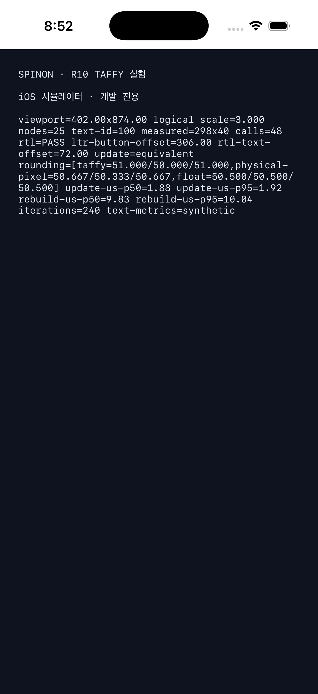
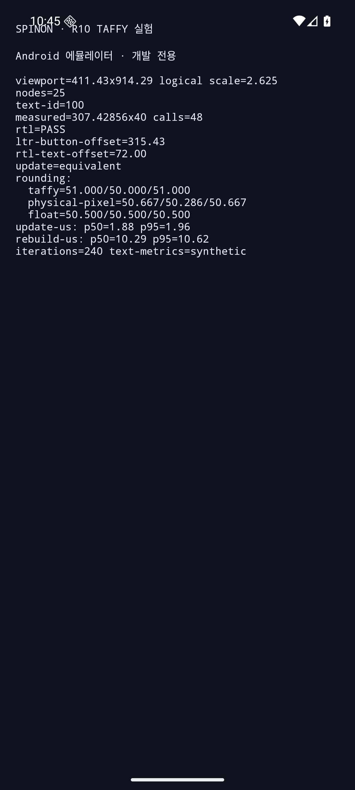

# R10 Taffy 적합성 실험 결과

**판정:** 실험 산출물 완료 · **제품 기능·GPU 렌더링·실기기 성능 완료를 뜻하지 않음**

## 확인한 내용

25개 노드의 작은 화면 fixture에서 외부 노드 ID가 레이아웃 갱신 뒤에도 기존 노드를 가리키는지, 텍스트 측정 콜백이 줄 높이를 반영하는지, RTL 행 순서가 바뀌는지, Taffy 반올림과 배율별 픽셀 경계 변환이 어떻게 달라지는지 확인했습니다. 첫 카드 높이를 바꾼 부분 갱신의 전체 geometry를 새 트리를 만든 결과와 비교했고 모두 일치했습니다.

각 앱은 실행 시 같은 fixture로 240개 표본을 측정했습니다. 다섯 번의 앱 실행을 반복했고 각 경로를 20회씩 예열했습니다. 측정 순서는 매 표본마다 부분 갱신과 전체 재생성을 번갈아 앞세웠습니다. 부분 갱신은 첫 카드의 스타일 변경과 Taffy 레이아웃 계산이며, 전체 재생성은 25개 노드 생성·레이아웃 계산·트리 해제를 포함합니다. 측정 안에서 계산 결과의 노드 geometry를 읽어 계산 결과가 실제로 사용되도록 했습니다.

## 개발용 FFI 경계

실험 앱은 `spinon_taffy_r10_run(width, height, scale, output, output_capacity)`를 동기 호출합니다. 호출 스레드에서 fixture를 계산하고, 호출자가 소유한 출력 버퍼에 NUL 종료 UTF-8 보고 문자열을 씁니다. 성공은 `0`, 잘못된 출력 버퍼는 `-1`, 레이아웃·입력 오류는 `-2`, 버퍼 부족은 `-3`, 실험 기능을 넣지 않은 기본 빌드는 `-4`입니다. 이 기호는 `SPINON_ENABLE_R10_EXPERIMENT=1` 빌드에서만 Taffy 계산을 실행합니다. 일반 빌드에는 같은 기호의 작은 비활성 응답만 포함되며 Taffy 의존 코드는 연결하지 않습니다. 이 경계는 보고 화면을 위한 내부 실험 ABI이며 공개 앱 API가 아니고, 호출 간 동시성은 검증하지 않았습니다.

## 환경과 빌드

| 환경 | 화면 논리 크기 | 배율 | 빌드 |
| --- | ---: | ---: | --- |
| iPhone 17 Pro 시뮬레이터, iOS 26.2 | 402×874 point | 3 | Rust release 라이브러리, Xcode Debug 앱 |
| `zl_poc` Android AVD, Android 16 (API 36), `sdk_gphone64_arm64` | 411.43×914.29 dp | 2.625 | Rust release 라이브러리, Gradle Debug APK |

이 값들은 전체 OS 논리 화면 크기를 실험 입력으로 사용했습니다. Taffy fixture에서 안전 영역·상태 막대·시스템 내비게이션 inset은 빼지 않았습니다. CSS px와 Android dp·iOS point 사이의 제품 매핑 규칙은 이번 실험에서 정하지 않았습니다. 물리 Android 기기 측정은 하지 않았습니다.

## 비용 측정

값은 마이크로초입니다. 각 분위수는 정렬한 240개 표본에서 `round((N−1)×q)` 위치를 선택합니다. 아래 중앙값은 실행 다섯 번의 p50/p95 중앙값이고, 대괄호는 다섯 실행의 최소–최대입니다.

| 환경 | 작업 | p50 중앙값 [범위] | p95 중앙값 [범위] |
| --- | --- | ---: | ---: |
| iOS 시뮬레이터 | 부분 갱신 | 1.88 [1.67–1.92] | 1.96 [1.92–2.38] |
| iOS 시뮬레이터 | 전체 재생성 | 9.79 [8.71–9.96] | 10.04 [9.75–12.12] |
| Android 에뮬레이터 | 부분 갱신 | 1.92 [1.88–1.92] | 3.17 [1.92–4.50] |
| Android 에뮬레이터 | 전체 재생성 | 10.21 [9.88–10.42] | 37.29 [10.00–113.21] |

이 fixture의 실행별 p50 중앙값에서 부분 갱신 비용은 전체 재생성보다 iOS에서 약 5.2배, Android에서 약 5.3배 낮았습니다. 전체 재생성에는 새 노드 할당과 트리 해제도 들어가므로 이 비율은 트리 재사용과 전체 재생성의 fixture 비용 차이이며, Taffy 알고리즘의 순수 속도 배수가 아닙니다. Android 전체 재생성 p95는 2·3·5회차에서 각각 92.96µs, 113.21µs, 37.29µs였습니다. 에뮬레이터 스케줄링 영향일 수 있지만 원인을 분리 측정하지 않았으므로 이상치도 원본에 그대로 보존했습니다. Android p95는 안정된 비교 근거로 보지 않습니다. 다섯 실행의 원본 결과는 [iOS 로그](./taffy-r10-2026-09-28-ios-log.md)와 [Android 로그](./taffy-r10-2026-09-28-android-log.md)에 있습니다.

이 비교는 같은 25개 노드 Taffy fixture에서 캐시된 트리를 갱신하는 작업과 노드를 새로 만들고 계산한 뒤 해제하는 작업의 비용입니다. 두 작업의 범위가 다르므로 Taffy 자체의 엔진 속도 차이나 React Native·Lynx·GPU 렌더러와의 성능 차이로 해석할 수 없습니다.

## 동작 결과와 해석

- 외부 정수 ID에서 Taffy `NodeId`로의 매핑을 유지했습니다. 스타일 부분 갱신 뒤 전체 노드의 x·y·width·height가 새 트리 계산값과 일치했습니다.
- 고정된 합성 글꼴 측정 fixture에서 측정 콜백이 동작했고, 첫 텍스트 노드는 iOS 298×40, Android 307.43×40 논리 단위였습니다. 실제 CoreText·Android 글꼴 shaping, 줄바꿈, 폴백은 호출하지 않았습니다.
- LTR/RTL 시작 방향 검사는 통과했습니다. 이 값은 fixture의 자식 배치 확인이며 전체 웹 bidi·텍스트 방향 지원을 뜻하지 않습니다.
- 동일한 151.5 논리 단위 컨테이너에서 Taffy 기본 반올림은 자식 폭을 51/50/51로 만들었고, 반올림을 끄면 50.5씩 유지했습니다. 후자의 공용 절대 경계를 배율에 맞춰 변환했을 때 폭은 iOS 50.667/50.333/50.667, Android 50.667/50.286/50.667 논리 단위가 됐습니다.
- GPU 출력과 실제 화면 pixel coverage는 측정하지 않았습니다. 따라서 렌더러 후보로는 레이아웃의 분수 논리 좌표를 보존하고 배율 변환을 래스터 경계에서 한 번 수행하도록 제안하되, 제품 좌표 계약은 R08 GPU 출력·hit-test fixture까지 보류합니다.

## 화면 캡처

아래 이미지는 개발 전용 보고 화면입니다. 보고 텍스트는 iOS `UITextView`, Android `TextView`로 표시되며, Taffy가 계산한 앱 UI를 GPU로 그린 화면은 아닙니다.

| iOS 시뮬레이터 | Android 에뮬레이터 |
| --- | --- |
|  |  |

캡처는 두 플랫폼의 원본 로그에 기록한 실행 1 결과입니다.

Android 캡처에서는 에뮬레이터의 TalkBack 초점 테두리를 숨기기 위해 캡처 중 접근성 오버레이를 잠시 껐고, 캡처 뒤 원래 설정을 복원했습니다.

## 재현과 검증

```sh
mise exec -- cargo test --locked --workspace
mise exec -- cargo test --locked --workspace --features spinon-ffi/r10-experiment
mise exec -- cargo test --locked --manifest-path spikes/style-layout/Cargo.toml
mise exec -- cargo tree -p spinon-ffi --locked
mise exec -- cargo tree -p spinon-ffi --locked --features r10-experiment
mise exec -- bun run build:ios-sim
mise exec -- bun run build:android
SPINON_ENABLE_R10_EXPERIMENT=1 mise exec -- bun run build:ios-sim
SPINON_ENABLE_R10_EXPERIMENT=1 mise exec -- bun run build:android
```

기본 기능을 꺼둔 Rust 테스트, 실험을 켠 Rust 테스트, iOS·Android 일반 빌드와 R10 실험 빌드가 모두 통과했습니다. R10 실험 빌드 앱은 개발 전용 `--spinon-r10` 인수로 실행하며 공개 JavaScript API는 추가하지 않았습니다. 현재 결과는 Taffy를 제품 코어, V8 UI 트리, CSS 지원 계약 또는 GPU 렌더 경로에 통합하지 않습니다.
