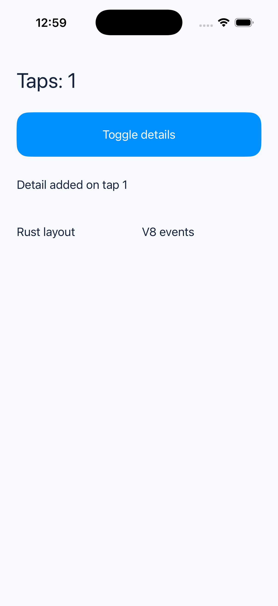
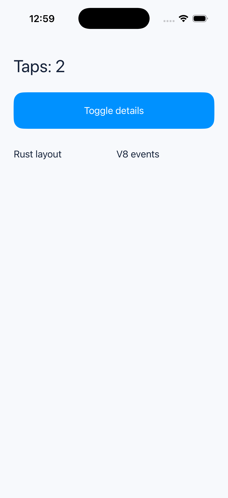

# iOS 시뮬레이터 동적 트리 실행

2026-09-27, iPhone 17 Pro 시뮬레이터(iOS 26.2)에 공식 V8 + 공통 Rust 트리 코어 + UIKit 호스트 앱을 빌드·설치했다. Android와 같은 [`tree.js`](../tree.js)를 실행했다.

버튼 첫 터치 후 접근성 트리에 `boson-node:4:Detail added on tap 1`이 나타났고, 두 번째 터치 후 사라졌다. 하단 행의 Rust 레이아웃 y 좌표는 `180 → 244 → 180pt`였다. 두 번 모두 `BOSON_TOUCH_RESULT=0`이 기록됐다. 이어 같은 앱에서 100회 연속 터치한 결과 접근성 텍스트가 `Taps: 102`였고, [시뮬레이터 로그](ios-events.log)에 성공 결과 104건이 기록됐다.

[동작 영상](ios-simulator-demo.mp4)

| 시작 | 노드 추가 | 노드 삭제 |
| --- | --- | --- |
|  |  |  |

UIKit은 Rust가 계산한 좌표를 `UILabel`과 `UIButton`에 적용한다. 화면의 상단 안전 영역 때문에 실제 접근성 화면 좌표에는 안전 영역 높이만큼 더해진다. iOS 실기기에서의 설치·실행과 성능 측정은 아직 확인하지 않았다.
