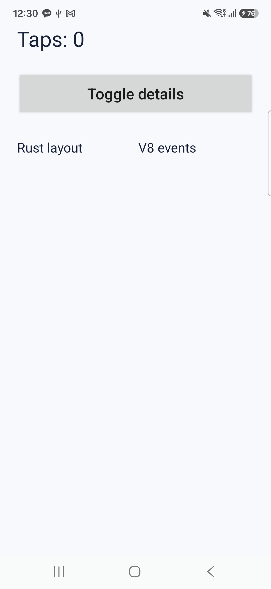
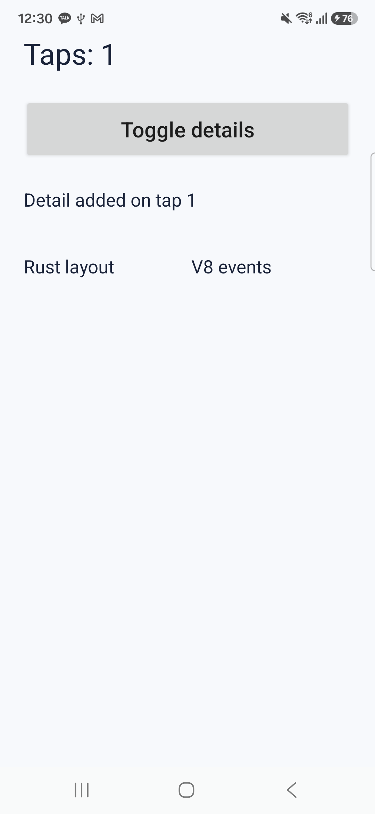

# Android 실기기 실행 기록

2026-09-27, USB 연결 `SM-S731N`, Android 16, 1080×2340 화면에서 로컬 빌드 APK를 설치하고 실제 화면의 버튼을 두 번 터치했다. Android 에뮬레이터가 동시에 연결되어 있어 모든 명령에 실기기 선택자 `adb -s`를 사용했다.

| 상태 | 화면에서 확인한 노드 | Rust 레이아웃이 계산한 하단 행의 y 좌표 |
| --- | --- | --- |
| 시작 | `Taps: 0`, 버튼, 하단 행 | `180dp` |
| 첫 터치 | `Taps: 1`, 새 상세 텍스트 `Detail added on tap 1`, 하단 행 | `244dp` |
| 두 번째 터치 | `Taps: 2`, 상세 텍스트 제거, 하단 행 | `180dp` |

[전체 실행 로그](physical-log.txt)에 `BOSON_NODE_CREATE id=4`, `BOSON_NODE_REMOVE id=4`, 위 세 좌표와 `BOSON_TOUCH_RESULT=0` 두 건이 기록됐다. 접근성 덤프에서도 첫 터치 후 `boson-node:4:Detail added on tap 1`이 나타났고 두 번째 터치 후 사라졌다.

[실기기 동작 영상](android-device-demo.mp4)

| 시작 | 추가 | 삭제 |
| --- | --- | --- |
|  |  |  |

이 결과는 노드 생성·삭제와 행·열 좌표 계산이 실기기 네이티브 뷰에 반영됨을 보여 준다. 텍스트 크기는 Android `TextView`가 그리며 Rust 레이아웃 엔진이 실제 글리프 크기를 측정한 결과는 아니다.
