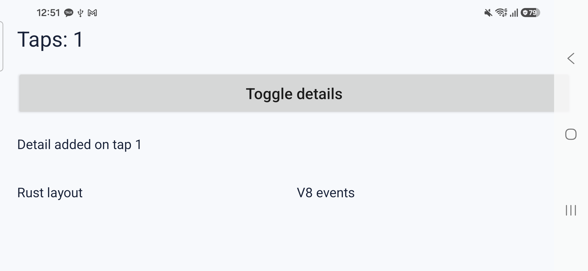
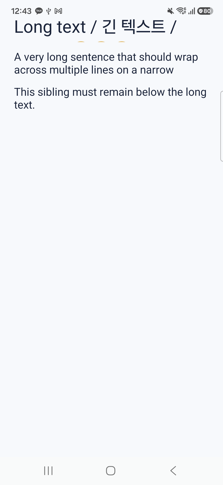

# 동적 트리 추가 검증 (2026-09-27)

대상은 USB 연결 Android 16 실기기 `SM-S731N`이다. 공식 V8 ARM64 정적 라이브러리와 Rust 코어를 포함한 로컬 APK를 설치했다. 실기기 명령에는 항상 `adb -s <기기-ID>`를 지정했다. 수치는 이 APK·기기·작업 부하의 관찰 결과이며 다른 프레임워크와 비교한 값이 아니다.

## 1. 트리 무결성과 크기 경계

`rustc --edition=2024 --test spikes/dynamic-tree/rust/tree.rs`로 6개 단위 테스트를 실행했고 모두 통과했다. 잘못된 부모·태그·중복 ID 거부, 자손을 포함한 삭제와 ID 재사용, 중첩 행·열의 형제 순서·간격·flex 배치, 과도한 정수 크기에서 패닉 방지, 1000개 노드 생성·레이아웃·삭제, 실패한 이벤트의 트리 스냅샷 복원을 확인했다. 정수 합계와 좌표는 포화 연산으로 보강했다.

## 2. 연속 터치와 오류

기본 화면에서 `adb shell input tap`을 연속 100회 실행했다. 접근성 덤프에 `boson-node:2:Taps: 100`, [실행 로그](rapid-100.log)에 성공한 `BOSON_TOUCH_RESULT=0` 100건과 JS 오류 0건이 남았다.

의도적으로 JS가 노드를 만든 직후 예외를 던지는 시나리오를 실행했다. 수정 전에는 Rust 트리만 바뀌고 화면은 그대로여서 다음 터치에 중복 ID 오류가 났다. 수정 후에는 이벤트 시작 전 Rust 트리 스냅샷을 복원하고 추가 이벤트를 막는다. [수정 후 로그](error-fixed.log)에는 최초 예외와 실패 결과 한 건만 있으며 화면에 `JS event failed; reopen the app`이 표시됐다. **JS 힙의 변수까지 롤백하지는 않는다.** 오류가 난 실행은 재시작해야 한다.

## 3. 회전·긴 텍스트·레이아웃 경계

첫 터치 후 `Taps: 1`과 상세 노드가 열린 상태에서 가로 회전했다. 같은 프로세스와 JS 상태가 유지됐고 버튼의 접근성 경계가 세로 화면 `[68,281][1013,461]`에서 가로 화면 `[68,281][2273,461]`로 바뀌었다. 다시 세로로 돌린 뒤 누르니 `Taps: 2`가 됐다. [회전 로그](rotation-final.log)에는 `832×384dp`와 `384×832dp` 재배치 결과가 모두 0으로 기록됐다.

한국어·아랍어·이모지와 긴 영문 문장을 넣어 확인했다. 노드 높이를 48dp로 고정한 상태라 Android `TextView`가 줄을 그리는 동안 글이 잘린다. 뒤 노드의 좌표는 고정 높이 다음으로 배치되지만, **Rust 엔진이 텍스트 높이를 측정해 공간을 늘리지는 못한다.** 과도하게 큰 자식은 패닉 없이 계산되지만 화면 밖으로 넘칠 수 있다.

## 4. 큰 트리에서의 시간과 메모리

각 시나리오는 앱 프로세스를 새로 시작해 버튼 1개와 텍스트 100·500·1000개를 만들었다. 이후 버튼을 30회 눌러 텍스트 하나와 동적 노드 하나를 변경했다. `dispatch_us`는 V8 이벤트와 Rust 트리 스냅샷·변경, `render_us`는 Rust 레이아웃 순회와 JNI·Android 뷰 갱신을 포함한다. 실제 프레임이 화면에 표시되기까지의 시간은 포함하지 않는다.

| 텍스트 노드 수 | 시작 시 `nativeCreate` (1회, ms) | `dispatch` 중앙값 (ms) | `render` 중앙값 (ms) | 합계 중앙값 (ms) | 30회 후 PSS (MiB) |
| ---: | ---: | ---: | ---: | ---: | ---: |
| 100 | 10.7 | 0.122 | 2.014 | 2.199 | 72.2 |
| 500 | 25.5 | 0.178 | 7.658 | 7.833 | 80.5 |
| 1000 | 37.5 | 0.260 | 10.602 | 10.860 | 90.4 |

1000개 조건의 30회에서 합계 최대는 15.788ms였고 오류는 없었다. [100개 로그](stress-100-30.log), [500개 로그](stress-500-30.log), [1000개 로그](stress-1000-30.log)에 개별 시간을 보관했다. 시작 시간은 `nativeCreate` 호출부터 초기 네이티브 뷰 생성까지이며 APK 실행·Activity 시작 시간은 아니다.

1000개 조건에서 별도로 500회 터치했을 때 성공 로그 500건, JS 오류 0건, 활성 뷰 수 1007개였다. PSS는 시작 79.6MiB, 100회 후 88.6MiB, 200회 후 111.6MiB, 500회 후 109.7MiB였다. 200회에서 500회 사이 감소했으므로 단조 증가로 보이지는 않지만, 이 관찰만으로 장기 메모리 누수가 없다고 판단할 수는 없다. 가비지 컬렉션과 화면 그리기 비용을 분리한 장시간 측정은 남아 있다.

이 작업 부하는 화면 밖에 있는 뷰까지 매 이벤트마다 모두 갱신한다. 따라서 측정치는 현재 전체 재계산·전체 갱신 구현의 비용이며, 최적화된 가상화 목록이나 React Native·Lynx와의 비교 결과가 아니다.
