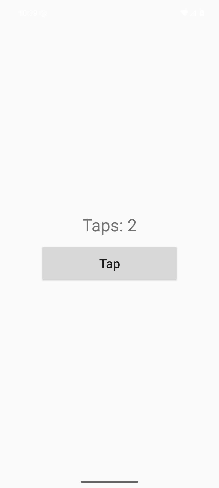

# Android 에뮬레이터 터치 기록

2026-09-26, Android 16 API 36 ARM64 에뮬레이터. 네 APK를 각각 설치·실행하고 화면의 `Tap` 버튼을 두 번 눌렀다. UI 접근성 덤프에서 모두 `content-desc="boson-counter:Taps: 2"`를 확인했다. 각 로그에는 JS에서 온 `Taps: 0`, `Taps: 1`, `Taps: 2`와 성공한 터치 결과 두 개가 기록됐다.

| 방식 | 실제 터치 후 화면 | 실행 로그 |
| --- | --- | --- |
| C++ 직접 V8 API | `Taps: 2` | [cpp_direct-touch.log](android/cpp_direct-touch.log) |
| C++ 공통 경계 | `Taps: 2` | [cpp-touch.log](android/cpp-touch.log) |
| Rust + 공통 경계 | `Taps: 2` | [rust-touch.log](android/rust-touch.log) |
| Zig + 공통 경계 | `Taps: 2` | [zig-touch.log](android/zig-touch.log) |

버튼에는 `adb shell input tap`으로 실제 UI 이벤트를 보냈다. 화면 상태는 `adb shell uiautomator dump`로, 앱 로그는 `adb logcat`으로 수집했다. Android용 V8은 [이전 실험의 Mac 교차 빌드 방식](../../v8-language-bridge/evidence/android-emulator-results.md)을 그대로 사용했다.
