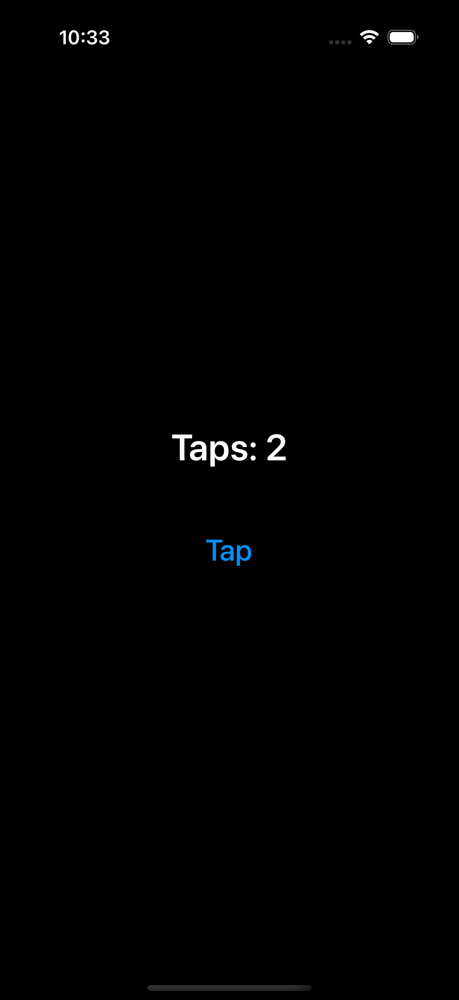

# iOS 시뮬레이터 터치 기록

2026-09-26, iPhone 17 Pro 시뮬레이터(iOS 26.2). 네 앱을 각각 설치·실행하고 화면의 `Tap` 버튼을 두 번 눌렀다. 화면 접근성 ID `boson-counter`의 텍스트는 모두 `Taps: 2`였다. 각 로그에는 JS에서 온 `Taps: 0`, `Taps: 1`, `Taps: 2`와 성공한 터치 결과 두 개가 기록됐다.

| 방식 | 실제 터치 후 화면 | 실행 로그 |
| --- | --- | --- |
| C++ 직접 V8 API | `Taps: 2` | [cpp_direct-touch.log](ios-sim/cpp_direct-touch.log) |
| C++ 공통 경계 | `Taps: 2` | [cpp-touch.log](ios-sim/cpp-touch.log) |
| Rust + 공통 경계 | `Taps: 2` | [rust-touch.log](ios-sim/rust-touch.log) |
| Zig + 공통 경계 | `Taps: 2` | [zig-touch.log](ios-sim/zig-touch.log) |

시뮬레이터 버튼은 `idb ui tap`으로 실제 UI 이벤트를 보냈다. 앱 표준 출력은 `xcrun simctl launch --console`로 수집했다. iOS 실기기에서의 실행은 확인하지 않았다.
